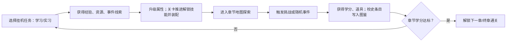
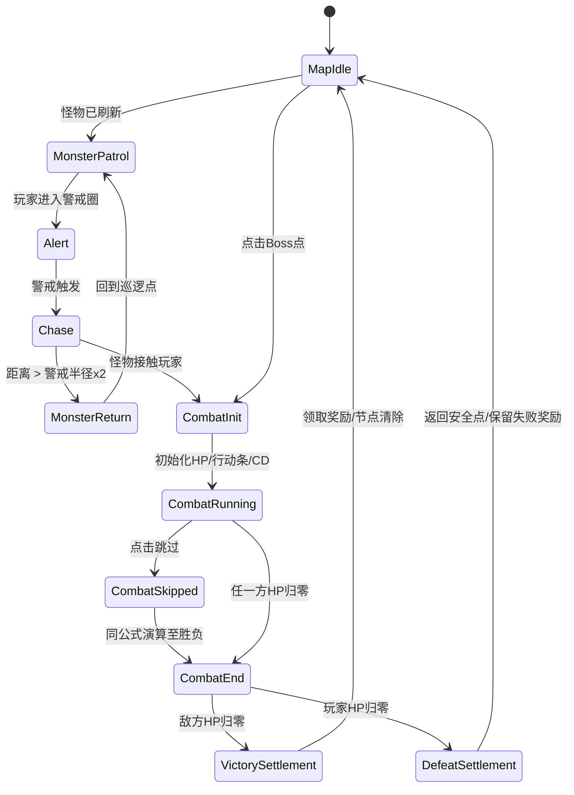
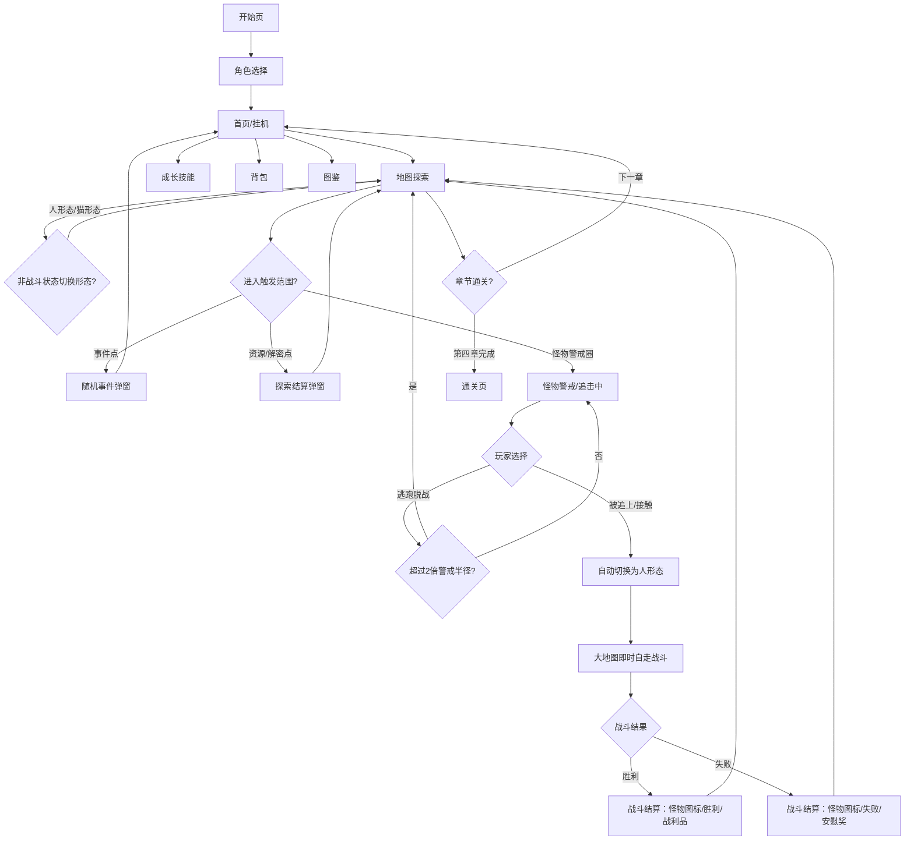
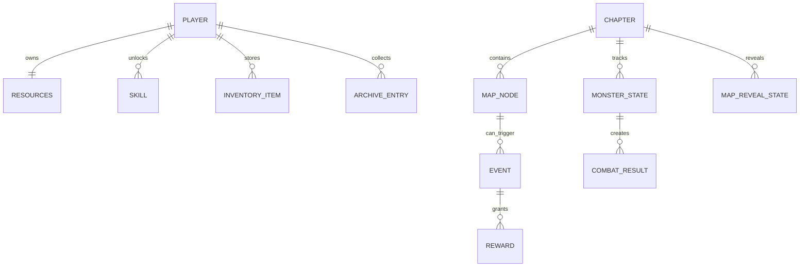

# 《同舟喵济》游戏策划案

**版本：** 初版  
**类型：** 单人网页放置 RPG  
**主角：** 学术喵——同济校园中的五位可选双形态主角

---

## 文档说明

| 项目 | 说明 |
| --- | --- |
| **文档用途** | 团队内部对齐：游戏方向、系统框架、内容边界与验收标准 |
| **文档成熟度** | **第一章**达到可拆任务执行粒度；**第二至四章**为方向性描述，专项设计后续按第一章同结构补齐 |
| **建议读者** | 主策划、战斗策划、关卡策划、数值策划、UI/场景/角色美术 |
| **待后续补充** | 主动技能完整配表（CD/倍率/目标数）、二至四章专项、全量事件/道具 ID 表、结局分支矩阵 |

### 初版交付状态

| 模块 | 当前状态 | 后续负责人 | 下一步交付物 |
| --- | --- | --- | --- |
| 核心方向与边界 | 已定稿 | 主策划 | 仅在范围变更时更新 |
| 第一章专项 | 仅作示例，细节待补充 | 关卡策划 / 战斗策划 | 第一章地图点位表、怪物配置表、事件表 |
| 二至四章专项 | 待补充 | 关卡策划 / 文案策划 | 按第一章结构补齐章节目标、地图、Boss、事件、图鉴条目 |
| 五角色定位 | 待补充 | 主策划 / 战斗策划 | 每角色完整 6 技能配表 |
| 主动技能数值 | 部分完成 | 战斗策划 / 数值策划 | Demo v1.0 已接入①②③摘要配置；④⑤后续章节占位 |
| 资源与学分规则 | 待补充 | 数值策划 | 章节奖励总表、首通/重复奖励表 |
| 随机事件池 | 待补充 | 文案策划 / 关卡策划 | 全量事件 ID 表、选项奖励、触发条件 |
| 道具与背包 | 待补充 | 系统策划 | 道具 ID 表、来源、使用限制、图标需求 |
| 校史图鉴与结局 | 待补充 | 文案策划 / 主策划 | 图鉴条目表、结局分支矩阵 |
| UI 与美术方向 | 待补充 | UI / 美术 | 页面线框、最低资产清单、最终风格稿 |
| 程序数据结构 | 待补充 | 程序 / 系统策划 | 实现用数据表结构与字段校对 |

### 表格索引

| 表格 | 所在章节 | 当前用途 | 后续补充方向 |
| --- | --- | --- | --- |
| 章节总览表 | §2.3 主线章节 | 对齐四章主题、冲突和解锁内容 | 二至四章专项展开 |
| 第一章地图点位表 | §2.4 第一章 2D 室内大地图设计 | 第一章关卡拆分和程序点位配置 | 补坐标、警戒半径、刷新规则 |
| 第一章怪物表 | §2.4 怪物与战斗 | 第一章敌人方向和掉落 | 补数值、技能 CD、表现需求 |
| 第一章道具表 | §2.4 第一章道具 | 第一章道具方向 | 汇总进全量道具 ID 表 |
| 第一章事件表 | §2.4 第一章随机事件 | 第一章事件方向和奖励 | 汇总进全量事件 ID 表 |
| 学分规则表 | §3.2.2 学分规则 | 章节解锁和技能解锁依据 | 补每章学分投放表 |
| 角色总表 | §4.2 五角色总表 | 选角、人形态、猫形态、战斗定位 | 补角色美术需求和战斗参数 |
| 技能配置表 | §4.4–§4.5 技能配置原则 / Demo v1.0 主动技能配置表 | 技能系统规则、被动配置、Demo 主动技能摘要 | 补④⑤完整技能 ID、CD、倍率、特效 |
| 第一章怪物奖励表 | §5.3 第一章正式怪物与奖励表 | 第一章 Demo 怪物数值、警戒、首通/重复奖励 | 二至四章按同结构补表 |
| 随机事件池表 | §6.2 事件池示例 | 事件主题和选项方向 | 补全 16+ 事件正式表 |
| 道具分类表 | §7.1 道具分类 | 道具类别和数量目标 | 补 ID、来源、效果、图标 |
| 关卡节奏表 | §8 学分与关卡节奏 | 等级、学分、技能解锁节奏 | 与数值表联动校准 |
| 页面原型草图 | §9.2 页面原型草图 | UI 信息架构和页面范围 | UI 细化线框 |
| 数据结构草案 | §10.3 简化数据结构 | 程序状态字段方向 | 程序实现另附数据表 |
| 美术资产清单 | §11.4 最低资产清单 | 美术最低交付范围 | 补尺寸、格式、优先级 |

**阅读指引：**

- 需要了解「做什么 / 不做什么」→ §1、文首「设计约束速查」
- 需要开第一章工 → §2.4、§3.2.2 学分规则、§4.4–§4.5
- 需要接战斗数值 → §4.4 技能类型约定 + §4.5 Demo v1.0 主动技能配置表（④⑤完整配表由战斗策划后续补齐）
- 需要接程序 → §10.3 `GameState` 与技能解锁伪代码

---

## 文档目录（可跳转）

### 快速入口

- [文档说明](#文档说明)
- [初版交付状态](#初版交付状态)
- [表格索引](#表格索引)
- [设计约束速查](#设计约束速查)
- [附录 A：第一章战斗数值配置文档 v1.01](#附录-a第一章战斗数值配置文档-v101)

### 正文目录

- [§1 项目概述](#1-项目概述)
  - [1.1 一句话概念](#11-一句话概念)
  - [1.2 游戏定位](#12-游戏定位)
  - [1.3 设计目标](#13-设计目标)
  - [1.4 平台和游玩时长](#14-平台和游玩时长)
  - [1.5 三周开发边界](#15-三周开发边界)
- [§2 世界观与叙事](#2-世界观与叙事)
  - [2.1 设定基调](#21-设定基调)
  - [2.2 时间设定](#22-时间设定)
  - [2.3 主线章节](#23-主线章节)
  - [2.4 第一章专项设计：AI 与协议革命](#24-第一章专项设计ai-与协议革命)
- [§3 核心循环](#3-核心循环)
  - [3.1 玩家循环](#31-玩家循环)
  - [3.2 核心资源（仅三种）](#32-核心资源仅三种)
  - [3.2.2 学分规则](#322-学分规则)
  - [3.2.1 特殊图鉴：校史记忆条目](#321-特殊图鉴校史记忆条目)
  - [3.3 挂机任务](#33-挂机任务)
  - [3.4 离线收益](#34-离线收益)
- [§4 五角色设计](#4-五角色设计)
  - [4.0 战斗职业定位体系](#40-战斗职业定位体系)
  - [4.0.1 双形态规则](#401-双形态规则)
  - [4.1 属性说明](#41-属性说明)
  - [4.2 五角色总表](#42-五角色总表)
  - [4.3 角色人设与选角说明](#43-角色人设与选角说明)
  - [4.4 技能配置原则](#44-技能配置原则)
  - [4.5 Demo v1.0 主动技能配置表](#45-demo-v10-主动技能配置表)
- [§5 探索与挑战系统](#5-探索与挑战系统)
  - [5.1 地图结构](#51-地图结构)
  - [5.2 完全自走战斗公式](#52-完全自走战斗公式)
  - [地图追击与战斗状态机](#地图追击与战斗状态机)
  - [5.3 第一章正式怪物与奖励表（Demo v1.0）](#53-第一章正式怪物与奖励表demo-v10)
- [§6 随机事件设计](#6-随机事件设计)
  - [6.1 事件规则](#61-事件规则)
  - [6.2 事件池示例](#62-事件池示例)
- [§7 道具与背包](#7-道具与背包)
  - [7.1 道具分类](#71-道具分类)
  - [7.2 装备简化](#72-装备简化)
- [§8 学分与关卡节奏](#8-学分与关卡节奏)
  - [8.1 第一章 Demo 学分投放逻辑](#81-第一章-demo-学分投放逻辑)
  - [8.2 第一章 Boss 推荐等级（战斗 v1.01）](#82-第一章-boss-推荐等级战斗-v101)
- [§9 界面与交互](#9-界面与交互)
  - [9.1 信息架构](#91-信息架构)
  - [9.2 页面原型草图](#92-页面原型草图)
- [§10 系统原型图](#10-系统原型图)
  - [10.1 页面流转](#101-页面流转)
  - [10.2 数据关系](#102-数据关系)
  - [10.3 简化数据结构](#103-简化数据结构)
- [§11 美术与表现](#11-美术与表现)
  - [11.1 视觉方向](#111-视觉方向)
  - [11.2 五角色外观差异](#112-五角色外观差异)
  - [11.3 文案语气](#113-文案语气)
  - [11.4 最低资产清单](#114-最低资产清单)
- [§12 内容量规划](#12-内容量规划)
- [§13 开发排期](#13-开发排期)
- [§14 验收标准](#14-验收标准)
- [§15 校园文化素材池](#15-校园文化素材池)
- [§16 参考资料](#16-参考资料)

### 附录目录

- [附录 A：第一章战斗数值配置文档 v1.01](#附录-a第一章战斗数值配置文档-v101)
  - [文档版本历史](#文档版本历史)
  - [一、角色属性说明](#一角色属性说明)
  - [二、战斗基础公式](#二战斗基础公式)
  - [三、暴击机制](#三暴击机制)
  - [四、闪避机制](#四闪避机制)
  - [五、完整攻击流程](#五完整攻击流程)
  - [六、角色总览](#六角色总览)
  - [七、莉娜](#七莉娜lina)
  - [八、阿宇](#八阿宇ayu)
  - [九、知夏](#九知夏zhixia)
  - [十、江寻](#十江寻jiangxun)
  - [十一、老登](#十一老登laodeng)
  - [十二、技能解锁节奏汇总](#十二技能解锁节奏汇总)
  - [十三、普通怪物配置](#十三普通怪物配置)
  - [十四、第一章 BOSS：AI 陆教授](#十四第一章bossai陆教授)
  - [十五、推荐挑战等级与数值验证](#十五推荐挑战等级与数值验证)
  - [十六、五角色战力速查](#十六五角色战力速查)
  - [十七、怪物配置汇总](#十七怪物配置汇总)

### 设计约束速查

| 维度 | 规则 |
| --- | --- |
| 角色 | 五选一（莉娜/阿宇/知夏/江寻/老登），**开局选定后全程使用**；每位角色拥有 **人形态/猫形态** 双形态，无转职、无换角、无辅助职业 |
| 资源 | 仅 **EXP / 学分 / 校园币**； |
| 收集 | **校史图鉴**影响结局，不影响战斗与 Boss 解锁 |
| 技能 | **3 战斗格**（格 1 固定普攻）+ 每角色 **6 备选位**（仅主动技能）；随 **关卡** 解锁 |
| 战斗 | 地图内完全自走；进入战斗后自动切换为人形态；Boss **无道具联动** |
| 范围外 | 多人、抽卡、付费、复杂装备词条 |

## 1. 项目概述

### 1.1 一句话概念

玩家从五位不同性格的「学术喵」中**五选一**，每位角色拥有 **人形态与猫形态**：人形态偏向战斗表现，猫形态偏向地图探索；选定后**以该角色贯穿序章至第四章全程通关**，通过放置挂机学习或实习积累能力，再进入同济校园主题地图探索，触发随机事件、收集道具与校史图鉴条目，最终在「120 周年校庆」章节凑齐学分毕业。

### 1.2 游戏定位

《同舟喵济》是一款面向同济大学学生及校园文化兴趣用户的 **网页端单人轻量放置 RPG**。游戏以「学术喵」为主角，通过挂机学习/实习、章节大地图探索、地图内完全自走战斗、随机校园事件与校史图鉴收集，形成轻松、可爱、低压力的校园冒险体验。

游戏不追求复杂战斗操作、长线商业化养成或重度数值竞争，而是强调 **三周内可完成的全章节可玩闭环**、角色差异、校园记忆、AI 课程主题和同济文化表达。

核心体验关键词：

- **轻量放置：** 玩家通过学习/实习获得 EXP 与校园币，形成持续成长。
- **地图探索：** 在章节大地图中开雾、收集、触发事件、遭遇怪物与 Boss。
- **自走战斗：** 战斗在地图中即时演算，玩家可选择 `1x / 2x / 跳过`。
- **校园叙事：** 通过章节事件、校史图鉴和节点解密讲述同济文化。
- **低成本可开发：** 优先保证序章至第四章完整通关，复杂系统以占位或后续扩展处理。

### 1.3 设计目标

- 在三周内完成一个 **序章 + 四章主线均可游玩并可通关** 的网页端单人版本。
- 让玩家完成「选角 → 挂机成长 → 章节大地图探索 → 地图即时自走战斗 → Boss 通关 → 下一章解锁 → 终章通关」的完整流程。
- 建立五角色双形态、三资源、技能装配、地图节点、怪物追击、战斗结算、道具背包、校史图鉴和结局统计的基础框架。
- 以第一章「AI 与协议革命」作为系统完整度最高的纵切样章；第二至四章复用同一套系统结构，通过地图风格、怪物、事件和 Boss 主题形成章节差异。
- 控制系统复杂度，不做多人、抽卡、付费、复杂装备、复杂技能树和长线活动系统。
- 内容量规划：五个战斗定位各一的角色、四章地图、16 个以上随机事件、12 个以上道具、30 个技能位（Demo v1.0 先实装每角色普攻 + 主动①②③，主动④⑤占位）。

### 1.4 平台和游玩时长

- 平台：PC 浏览器优先，兼容移动浏览器。
- 会话长度：每次 3-10 分钟。
- 完整通关：约 2-4 天自然挂机，或 60-90 分钟集中体验版。

### 1.5 三周开发边界

必须做：

- 角色选择：**五选一，选定后不可更换**，每角色提供人形态与猫形态，以同一角色通关全部章节（无辅助职业）。
- **3 技能格战斗配置**（普攻固定 + 2 主动装配）与关卡解锁备选池。
- 学习/实习两种挂机任务。
- 离线收益，建议上限 8 小时。
- 四章地图节点推进。
- 自动结算式探索挑战。
- 随机事件与选项奖励。
- 背包、道具使用、校史图鉴。
- 结局与通关统计。

明确不做：

- 多人、聊天、排行、公会。
- 抽卡、付费、赛季、活动日历。
- 复杂装备词条、强化、合成、洗练。

## 2. 世界观与叙事

### 2.1 设定基调

游戏采用轻喜剧校园冒险。学术喵不是救世主，而是一个一边赶课、一边找实习、一边被校园事件牵着走的同济学生。事件文本要有校园生活感，但不做内部黑话堆叠，确保玩家理解。

### 2.2 时间设定

同济大学始于 1907 年，因此游戏第四章“120 周年校庆”设定为 2027 年前后的近未来校园幻想章节。当前修订时间为 2026 年 7 月 1 日，第四章应作为“未来校庆筹备/想象线”处理，而不是现实已发生事件。

### 2.3 主线章节

#### 序章：新生报道·迷雾初现
主题：新生报道、图书馆异动、核心功能解锁。
场景：主页插画、宿舍课桌、图书馆入口/书架区、食堂消息提示、校园超市。
关键 NPC：辅导员周老师负责新生引导；“同小智”负责系统提示与事件播报；图书馆异常书页作为第一次事件源。
冲突：新生报道当天，图书馆借阅记录和书架目录出现异常，部分书页被不明迷雾打乱。学术喵需要在猫形态下巡查书架、在必要时切换人形态完成第一次演示战斗，确认校园里出现了连续异常事件。
目标：完成选角、双形态教学、挂机学习/实习教学、背包与角色面板解锁，并获得第一条校史图鉴线索。
解锁：主页插画功能入口、双形态切换、挂机、背包、角色面板、图鉴入口。

#### 第一章：AI与协议革命

主题：从零开始理解 AI 协作，让AI帮助主角完成学习任务
场景：选课确认台、课程教室、提示词走廊、资料室·数据边界区、路演教室、智能体对话空间、课程考核教室。  
关键 NPC：陆教授负责引导课程与地图探索；“同小智”负责系统提示和事件播报；“AI 陆教授”是课程系统生成的考核镜像，作为本章 Boss。  
冲突：学术喵选修了「AI 与协议革命」，却在学习探索中生成了一系列 AI 智能体怪物。玩家需要通过学习、探索、打怪和随机事件推进课程进度，最终打败 AI 陆教授通过考核。  
通关目标：累计 **20 学分**，击败「AI 陆教授」完成课程考核。  
解锁：章节大地图探索、怪物警戒追击、自走战斗、主页插画功能入口、背包、图鉴、**3 技能格与技能装配**、首批备选技能（普攻 + ①）。


#### 第二章：樱花济与食堂危机

主题：校园生活、樱花记忆、公共空间与日常秩序。  
场景：四平路校区、樱花道、图书馆外广场、129 礼堂外广场、学苑食堂。  
冲突：樱花季游客与学生任务同时涌入，校园手账被花瓣打乱；与此同时，食堂供应记录被“饥饿幽灵”搅乱，小鱼干补给和便当订单陆续失踪。学术喵需要修复“樱花济手账”，追回被偷吃的校园美食，让校园生活恢复节奏。  
通关目标：累计 45 学分，完成“樱花济手账”，平息食堂危机。  
分支：樱花树下的约定。满足前置图鉴线索后，在樱花道遇到沉睡的粉色猫咪“小樱”，通过寻找樱花发簪解锁隐藏图鉴与结局文案变体；该收集不改变战斗数值。  
解锁：事件选项分支、食堂补给事件、备选技能 ④。

#### 第三章：智械危机

主题：工程伦理、人机协作、智能系统可靠性与校园守护。  
场景：嘉定校区、机器人赛道、智能车库、设备调试间、地下数据节点、算法核心机房。  
冲突：图书馆迷雾与食堂危机背后的异常信号汇聚成“混沌核心”，校园智能设备开始过度追求效率，把吃饭、休息、赶课都排成最优任务。学术喵需要追踪异常智能体，校准目标函数，并在核心机房完成本章决战。  
通关目标：累计 80 学分，完成“智械校准协议”，击败并净化“混沌核心”。  
角色表现：文案策划中的“最终决战感”在本章转化为所选角色的单人高光台词。莉娜强调守护与精灵协战，阿宇强调冲锋与担当，知夏负责弱点分析，江寻负责精准打击，老登负责稳健破防；不引入组队战斗、全员治疗或角色阵亡。  
解锁：高级地图节点、稀有道具、备选技能 ⑤（全池解锁）。

#### 第四章：120 周年校庆

主题：同舟共济、校史传承、未来展望。  
场景：校史馆、四平路主会场、嘉定分会场、沪西/沪北回忆节点、最终舞台。  
冲突：校庆展览需要集齐跨时代记忆：1907 起点、1923 定名、1927 国立、1940 李庄办学、1979 恢复对德交流、2000 合并新同济、2017/2022 双一流等。  
通关目标：累计 120 学分，点亮“同舟共济”终章。  
结局：学术喵顺利毕业，根据 **所选角色、校史图鉴收集度** 及章节事件解锁对应结局分支，解锁通关统计与二周目加成。

### 2.4 第一章专项设计：AI 与协议革命

#### 章节定位

第一章承担三件事：教学、立住世界观、给玩家第一次“打怪升级并通关”的爽感。它不需要做大，但每个系统都要露面一次：

- 通过陆教授开场讲解，引入“让AI替你做”的核心概念。
- 通过低难度怪物，让玩家理解属性、挂机收益、地图探索和掉落。
- 通过随机事件，让玩家理解什么东西“归AI，什么东西归我” 。
- 通过 AI 陆教授 Boss，把本章所有学习内容收束成一次课程考核。

#### 章节目标

| 目标 | 数值                        |
| --- |---------------------------|
| 推荐等级 | Lv.1-Lv.7                 |
| 通关学分 | 20 |
| 校史图鉴（第一章） | 2 条可选；**影响结局分支**，不影响 Boss 解锁 |
| 章节时长 | 集中体验 20-35 分钟；自然挂机 2-4 小时 |
| 新手解锁 | 章节大地图探索、怪物警戒追击、自走战斗、主页插画功能入口、背包、图鉴、3 技能格与首批备选技能 |
| 技能解锁（本章） | ① 进入第一章；② 学分 ≥ 8；③ 第一章通关（见 §4.4、§8） |

#### 关键角色

| 角色 | 功能              | 性格与文案方向                |
| --- |-----------------|------------------------|
| 陆教授 | 章节引导、章节旁白、考核发起人 | 温和但要求清晰，强调“先定义问题，再使用工具” |
| 同小智 | 系统助手、挂机播报、事件提示  | 机灵但偶尔过度执行，需要玩家校准       |
| AI 陆教授 | 第一章 Boss、课程系统镜像 | 逻辑严密、追问漏洞，会制造“看似正确”的陷阱 |
| 学术喵 | 玩家角色            | 从“会用AI”成长为“会借AI的人” |

#### 章节叙事流程

1. 选课：学术喵抢到“AI 与协议革命”选修课，陆教授发放道具“教学课件”。
2. 预习：玩家选择学习挂机，积累第一批 EXP，并遇到“拖延弹窗”。
3. 入门战斗：在提示词走廊击败“含糊需求怪”，理解提示词不是许愿。
4. 边界学习：在资料室·数据边界区触发隐私、引用和幻觉相关事件。
5. 路演与对话：在路演教室击败「幻觉答案体」，再进入机房·智能体对话空间处理「需求膨胀兽」。
6. 课程考核：陆教授开放考核门，玩家挑战 AI 陆教授。
7. 通关：击败 AI 陆教授后获得 20 学分结算，解锁第二章“樱花济与食堂危机”。

#### 第一章 2D 室内大地图设计

第一章地图是一张“室内课程楼层大地图”。玩家操控学术喵在俯视 2D 教学空间中移动，镜头跟随角色；课程入口、课程教室、提示词走廊、资料室、路演教室、机房和考核教室是地图上的空间区域。玩家点击地面或地标后，学术喵沿室内通道移动；未探索区域用雾化遮罩处理。怪物分布在不同区域，拥有警戒范围，玩家接近后怪物会主动追击并在接触后触发完全自走战斗。第一章不使用校门、草坪、樱花道、129 礼堂外广场等室外校园景观素材，这些素材留给后续章节形成差异化地图风格。

```text
+------------------------- 第一章：AI与协议革命·室内大地图 -------------------------+
|  课程入口/选课确认台                                                               |
|       │                                                                            |
|  课程教室 ── 提示词走廊 ── 资料室·数据边界区 ── 路演教室                         |
|       │                 ▲含糊需求怪警戒圈        ▲解密：1907 时间线               |
|  签到桌/自习角         │                          ▲幻觉答案体警戒圈               |
|                         └──────── 机房·智能体对话空间 ───── 考核教室              |
|                                      ▲需求膨胀兽巡逻           ▲AI陆教授 Boss      |
+----------------------------------------------------------------------------------+
```

地图交互规则：

- 地图以一张可滚动/可镜头跟随的室内大地图呈现。
- 未探索区域显示雾化遮罩；进入区域后揭示地标、资源点、解密点和怪物警戒圈。
- 怪物默认沿短路径巡逻，玩家进入警戒圈后怪物先提示再主动追击。
- 追击阶段玩家可选择逃跑脱离仇恨；怪物追击距离超过警戒圈半径的 2 倍后，会放弃追击并回到原巡逻点。
- 怪物接触玩家，或追击计时结束时玩家仍在警戒范围内，立即在大地图当前位置进入完全自走战斗。
- 战斗完全自动进行，玩家只能选择 `1x`、`2x` 或 `跳过`；跳过只加速演算，不改变结果。
- 战斗过程均在大地图上即时演算，结算页只显示怪物图标、胜负状态和战利品结算。
- 收集点靠近后拾取 **EXP、校园币或消耗品**。
- 地标解密点放在资料室展板、路演教室投影墙等室内地标旁；完成后 **解锁校史图鉴条目**（见 §3.2.1）。
- **校史图鉴条目** 不进入资源栏，不提供战斗加成，不影响 Boss 难度与解锁条件；**影响终局/章节结局分支**。
- Boss 考核门在 **章节内学分达到 12** 后解除锁定（见 §3.2.2）；击败 Boss 且 **全游戏累计学分 ≥ 20** 即第一章通关。

| ID | 地图区域/锚点 | 类型 | 敌方或交互 | 触发方式 | 首通奖励 | 重复奖励/收集 |
| --- | --- | --- | --- | --- | --- | --- |
| S-1 | 课程入口·选课确认台 | 教学点 | 陆教授发放教学课件 | 点击陆教授 | 教学课件、EXP +30 | 不可重复 |
| M-1 | 课程教室西侧 | 巡逻怪 | 拖延弹窗 x1 | 进入警戒圈后追击 | 学分 +2、EXP +50 | EXP +20、校园币 +6 |
| M-2 | 提示词走廊中段 | 巡逻怪 | 含糊需求怪 x1 | 进入警戒圈后追击 | 学分 +4、EXP +50 | EXP +30、校园币 +8 |
| E-1 | 资料室·数据边界区 | 事件点 | 隐私、引用、幻觉事件；可触发复制粘贴影 | 靠近资料桌后点击 | 提示词卡片、EXP +25 | EXP +15 |
| M-3 | 路演教室中央 | 巡逻怪 | 幻觉答案体 x1、过拟合史莱姆 x1 | 进入警戒圈后追击 | 学分 +5、EXP +45 | EXP +30、校园币 +10 |
| M-4 | 机房·智能体对话空间 | 小 Boss 巡逻怪 | 需求膨胀兽 x1 | 进入机房后主动锁定 | 学分 +4、EXP +40 | EXP +25、校园币 +8 |
| B-1 | 考核教室·AI 陆教授 | Boss 点 | AI 陆教授 x1 | 学分 ≥12 后点击考核门 | 学分 +8、章节通关 | 不可重复 |
| C-1 | 签到桌·课堂签到 | 收集点 | 点击拾取 | 靠近自动高亮 | 课堂签到章、校园币 +20 | 每日少量校园币 |
| C-2 | 自习角·便签堆 | 收集点 | 点击拾取 | 靠近自动高亮 | EXP +30 | 每 30 分钟刷新，少量校园币 |
| P-1 | 资料室门口展板 | 解密点 | 时间线排序 | 靠近展板后点击 | 校史图鉴·1907 起点 | 解锁图鉴条目，影响结局分支 |
| P-2 | 路演教室投影墙 | 解密点 | 关键词连线 | 靠近投影墙后点击 | 校史图鉴·同舟共济 | 解锁图鉴条目，影响结局分支 |

#### 怪物与战斗

第一章地图探索中的战斗为完全自走战斗，不引入行动点或体力类限制。玩家靠近怪物警戒圈后，怪物会从巡逻点转向并主动追击学术喵；玩家可以选择逃跑，若把怪物带出警戒圈半径 2 倍距离，怪物会脱离仇恨并返回原巡逻点。接触开战后，角色与怪物直接在地图当前位置播放战斗动画。双方根据速度条行动，普攻与技能按冷却循环释放。玩家不能手动释放技能，只能切换 `1x`、`2x` 或选择 `跳过`。跳过会直接按同一套战斗逻辑演算到结尾，不改变胜负。只要学术喵在自身血量耗尽前击败敌人，即判定该怪物清除；若学术喵先倒下，则战斗失败并保留少量 EXP 安慰奖。战斗结算页不展示日志，只展示怪物图标、胜利或失败状态，以及战利品结算。

| 怪物 | 出现场景 | 定位 | HP | 速度 | 技能循环 | 掉落 |
| --- | --- | --- | --- | --- | --- | --- |
| 拖延弹窗 | 课程教室 | 新手怪 | 80 | 慢 | 每 4 秒释放“再等五分钟”，造成 1.1 倍伤害 | EXP、校园币 |
| 含糊需求怪 | 提示词走廊 | 教学怪 | 130 | 中 | 每 5 秒释放「需求雾化」，降低玩家下一次技能伤害 | EXP、校园币 |
| 复制粘贴影 | 资料室·数据边界区 | 事件怪 | 120 | 快 | 每 3 秒释放「错误引用」，连续命中会叠加漏洞层数 | 校园币 |
| 幻觉答案体 | 路演教室 | 核心怪 + 闪避教学 | 180 | 中 | 自身 5% 闪避；每 6 秒释放「流畅胡说」，造成 1.6 倍不可闪避伤害 | EXP、校园币 |
| 过拟合史莱姆 | 路演教室 | 资源怪 | 160 | 慢 | 血量低于 40% 时释放「训练集黏液」，短暂减速玩家 | 校园币 |
| 需求膨胀兽 | 智能体对话空间 | 小 Boss | 260 | 中 | 每 7 秒释放「范围蔓延」，对玩家造成持续伤害 | EXP、校园币 |

#### Boss：AI 陆教授

AI 陆教授不是反派，而是课程系统生成的“协议考核镜像”。它的目标是用连续追问检验玩家是否真正理解 AI 协作。

进入条件：

- **章节内学分 ≥ 12**（解锁考核门，见 §3.2.2）。
- **全游戏累计学分** 未达 20 前可反复挑战；通关需累计 ≥ 20 且击败 Boss。
- 等级建议 Lv.6 以上。

Boss 三阶段（纯血量阶段，**无道具联动**）：

| 阶段 | 触发条件 | AI 陆教授技能 | 教学主题 |
| --- | --- | --- | --- |
| 1：问题定义 | Boss HP 100%-66% | 「追问目标」每 5 秒，中等伤害 | 先明确目标 |
| 2：边界审查 | Boss HP 65%-33% | 「协议漏洞」每 6 秒，叠加漏洞层数 | 数据边界与责任 |
| 3：幻觉校验 | Boss HP 32%-0% | 「流畅幻觉」每 4 秒，低血量频率提高 | 验证答案真实性 |

Boss 辅助规则：

- 连续失败 2 次后，触发陆教授提示事件「回到图书馆查证」，奖励 **EXP +30**，下一次 Boss 战开场护盾 +30%。
- Boss 战 **不读取** 任何携带道具的特殊效果；道具仅服务挂机与探索消耗。

Boss 胜利文本：

> AI 陆教授停下了连续追问：“你没有把 AI 当作答案机器，而是先写清了目标、边界、验证与责任。考核通过。”陆教授从讲台后点点头，把第一枚正式学分徽章盖在了学术喵的人物面板上。

#### 第一章道具

道具 **不参与 Boss 阶段联动**。仅分消耗品 / 纪念品，影响挂机或一次性探索收益。

| 道具 | 类型 | 来源 | 效果 |
| --- | --- | --- | --- |
| 教学课件 | 纪念品 | 选课确认台 | 解锁图鉴条目「AI 与协议革命」；无战斗效果 |
| 提示词卡片 | 学习道具 | 资料室事件 / 提示词走廊 | 学习挂机 EXP +8% |
| 数据脱敏胶带 | 消耗品 | 随机事件 / 过拟合史莱姆 | 下一场战斗开场减伤 10% |
| 课堂签到章 | 纪念品 | 签到桌 / 随机事件 | 校园币 +20，图鉴条目 +1 |

#### 第一章随机事件

| 事件 | 场景 | 选项 A | 选项 B | 奖励/后果 |
| --- | --- | --- | --- | --- |
| 陆教授的第一问 | 选课确认台 | 先写问题定义 | 直接问 AI 怎么做 | A：EXP +30；B：EXP +10 |
| 大模型把校训写错了 | 挂机/图书馆 | 查证后修正 | 直接提交 | A：EXP +40、校园币 +10；B：EXP +10 |
| 提示词许愿池 | 提示词走廊 | 写清输入输出 | 加一句「越详细越好」 | A：下一场战斗技能伤害 +10%；B：触发含糊需求怪 |
| 数据能不能都喂进去 | 资料室·数据边界区 | 做脱敏处理 | 直接上传 | A：数据脱敏胶带；B：下一场战斗开场受到一次「协议漏洞」 |
| AI 生成的参考文献 | 资料室 | 逐条核对 | 复制进报告 | A：EXP +25、校园币 +8；B：触发复制粘贴影 |
| 同小智过度热心 | 任意 | 调低自动建议 | 全部接受 | A：EXP +25；B：EXP +40，但下一次事件隐藏稀有选项 |
| 课间十分钟 | 任意 | 喝水休息 | 继续刷题 | A：下一场战斗开场护盾 +30；B：EXP +35、下一场战斗开场血量 -10% |

#### 第一章校史图鉴与结局分支

| 第一章校史图鉴收集 | 通关后结局分支 |
| --- | --- |
| 0/2 | **标准结局**：课程考核通过，学分结算 |
| 1/2 | **记忆未完整**：通关文案提及「还有校史线索未补齐」 |
| 2/2 | **同舟共济·记忆完整**：解锁隐藏结局标题 + 图鉴 completion 标记 |

#### 章节内学分节奏

| 来源          | 学分 |
|-------------| --- |
| 课程教室首通       | +2 |
| 提示词走廊首通     | +4 |
| 路演教室首通      | +5 |
| 机房·智能体对话空间首通 | +4 |
| 随机事件小奖励     | +0 到 +3 |
| AI 陆教授 Boss | +8 |

为了避免玩家卡关，第一章理论可获得学分应为 23-25，但通关只要求 20。

#### 第一章界面原型

地图页：

```text
+----------------------------------------------------------------+
| 第一章：AI与协议革命      学分 14/20  校史图鉴 1/2                    |
+----------------------------------------------------------------+
| 2D 室内大地图：镜头跟随 + 区域雾化 + 怪物警戒追击                |
|                                                                |
| 课程入口 ─ 课程教室 ─ 提示词走廊 ─ 资料室 ─ 路演教室             |
|    │          ▲拖延弹窗       ▲含糊需求怪      ▲幻觉答案体       |
| 签到桌/自习角 └────────────── 机房 ───────── 考核教室            |
|                           ▲需求膨胀兽           ▲AI陆教授        |
|                                                                |
+----------------------------------------------------------------+
| 当前区域：路演教室                                              |
| 状态：已进入幻觉答案体警戒圈，敌人正在追击                      |
| 首通：学分 +5 / EXP +45 / 校园币 +10                             |
| [继续移动] [逃跑脱战] [1x] [2x] [跳过战斗]                         |
+----------------------------------------------------------------+
```

战斗结算页：

```text
+----------------------- 战斗结算 ----------------------+
|                    [怪物图标：幻觉答案体]              |
|                         战斗胜利                       |
|--------------------------------------------------------|
| 战利品：EXP +45 / 学分 +5 / 校园币 +10                         |
| [继续探索] [回到主页] [查看背包]                       |
+--------------------------------------------------------+
```

Boss 考核页：

```text
+---------------- 课程考核：AI陆教授 ------------------+
| 阶段 2/3：边界审查                  Boss HP 58%      |
| AI陆教授：如果同学把所有聊天记录都交给模型，会怎样？ |
| （叙事选项，不影响 Boss 数值；纯自走战斗继续）      |
+------------------------------------------------------+
| 学分 14/20  校史图鉴 1/2  推荐Lv.6                  |
+------------------------------------------------------+
```

## 3. 核心循环

### 3.1 玩家循环



### 3.2 核心资源（仅三种）

| 资源 | 来源 | 用途 | 设计目的 |
| --- | --- | --- | --- |
| 经验 EXP | 学习、实习、探索、战斗、失败安慰奖 | 升级、提升属性 | 支撑长期成长 |
| 学分 Credit | 地图节点、章节 Boss、部分事件 | 章节解锁与最终通关 | 通关核心目标 |
| 校园币 Coin | 实习、事件、探索、战斗 | 购买消耗品 | 让实习有明确价值 |

#### 3.2.2 学分规则

学分是通关的**唯一硬指标**，分两层统计，不可混淆：

| 字段 | 含义 | 用途 |
| --- | --- | --- |
| **全游戏累计学分** | 所有章节获得的学分之和，存入 `resources.credits` | UI 进度（如「36/45」）、跨章通关判定、终章毕业（120） |
| **当前章章节内学分** | 仅统计**当前章节**探索/战斗/事件获得的学分，存入 `progress.chapterCredits` | 第一章 Boss 门（≥12）、技能 ② 解锁（≥8）；**切换章节时清零** |

**累计制与章节里程碑：**

- 学分为**只增不减**的累计值（战斗失败不扣学分）。
- 下表中的「学分目标」指 **全游戏累计学分** 需达到的阈值：

| 里程碑 | 累计学分阈值 | 含义 |
| --- | --- | --- |
| 第一章通关 | **20** | 击败 AI 陆教授且累计 ≥ 20，解锁第二章 |
| 第二章通关 | **45** | 累计 ≥ 45，解锁第三章 |
| 第三章通关 | **80** | 累计 ≥ 80，解锁第四章 |
| 终章毕业 | **120** | 累计 ≥ 120，触发通关结算 |

**UI 展示约定：**

- 地图页 / 首页显示 `当前累计 / 下一里程碑`（如第一章进行中：`14/20`；第二章进行中：`36/45`）。
- 第一章 Boss 考核门、技能 ② 解锁，读取 **章节内学分** `chapterCredits`，与累计值分开判定。

**与其它资源的关系：**

- 挂机（学习/实习）**不产生学分**；学分仅来自地图探索、战斗首通、Boss 与部分事件。
- 校史图鉴、道具、EXP、校园币的获取**不替代**学分进度。

**明确不属于资源的系统：**

- **灵感**：若出现，仅为角色 **四维属性**（见 §4.1），不是可拾取/可消耗资源。
- **校史记忆碎片**：仅为 **特殊图鉴条目**（见 §3.2.1），不计入资源栏。

### 3.2.1 特殊图鉴：校史记忆条目

| 项目 | 说明 |
| --- | --- |
| 获取方式 | 地标解密、章节事件、终章探索 |
| 存储位置 | 图鉴页「校史记忆」分栏，**不进入** `resources` |
| 战斗影响 | **无**（不加属性、不改 Boss 难度、不触发道具联动） |
| 结局影响 | **有**——按章节/全收集度解锁 **结局分支** 与隐藏标题 |
| 第一章条目 | 校史图鉴·1907 起点、校史图鉴·同舟共济（各 1 条） |

终局结局分支：

| 全游戏校史图鉴收集率 | 结局分支 |
| --- | --- |
| < 50% | 标准毕业结局 |
| 50%-99% | 记忆犹存结局（文案变体） |
| 100% | 同舟共济·完整校史结局 |

### 3.3 挂机任务

| 任务 | 每 5 秒基础收益 | 额外效果 | 适合阶段 |
| --- | --- | --- | --- |
| 学习 | EXP +10 | 提升学识属性与法术类伤害 | 全阶段 |
| 实习 | EXP +6，校园币 +8 | 提升实践属性与物理类伤害 | 全阶段 |


### 3.4 离线收益

- 记录离线时间，最多结算 8 小时。
- 学习离线收益：EXP。
- 实习离线收益：EXP、校园币。
- 不离线自动获得学分，学分必须通过探索或事件获得。
- 重新进入游戏时弹出“离线收获”面板。

## 4. 五角色设计

五位可选主角：**开局五选一，选定后本局全程使用该角色**，从序章通关至第四章毕业；**不可转职、不可换角**，不设辅助职业。莉娜的「治愈、守护」体现在人设与召唤精灵并肩作战的机制中，精灵仅负责输出与控场。

### 4.0 战斗职业定位体系

| 定位代号 | 定位名称 | 战斗职责 | 典型机制 | 明确不做 |
| --- | --- | --- | --- | --- |
| `DPS-Burst` | 法术爆发 | 高倍率法术伤害 | AOE、技能连击、学识加成 | 不回血、不增益队友 |
| `DPS-AOE` | 范围物理 | 多目标物理输出 | 齐射、穿透、散射 | 不治疗、不做团队 Buff |
| `DPS-Strike` | 敏捷突击 | 高机动单体输出 | 首击加成、连击、突进 | 不吸血、不复活 |
| `SUM-Spirit` | 召唤协同 | 精灵自动协战、多线输出 | 召唤物、精灵连击、集火 | 精灵不治疗、不复活玩家 |
| `Tank-Heavy` | 重装坦克 | 承伤、嘲讽、反伤 | 高生命、混凝土护盾、钢筋反震 | 不给队友加盾/加血 |

**召唤协同规则（莉娜专属）：**

- 战斗中莉娜可召唤 **1 只学风精灵**（同时场上上限 1 只）。
- 精灵在完全自走战斗中 **自动攻击**，玩家不可手动操控；与主角共享同一套时间轴演算。
- 精灵属性：攻击 = 莉娜攻击 × 35%（随等级成长）；生命 = 莉娜最大生命 × 20%（精灵消失后需技能冷却再召）。
- 精灵 **只造成伤害或施加减益**，不提供任何治疗。

五位角色与定位 **一一对应**；选角后 **战斗风格与技能池固定至通关**，不可中途更换角色。

### 4.0.1 双形态规则

每位角色拥有 **人形态** 与 **猫形态** 两套外观和表现用途：

- **人形态：** 偏向战斗表现。进入战斗、Boss 考核、战斗结算时默认使用人形态，所有战斗技能、普攻、受击和胜利表现均按人形态播放。
- **猫形态：** 偏向探索表现。章节大地图、主页插画、资源点拾取、地标解密、校史图鉴收集等场景可使用猫形态，强调轻巧、可爱、校园探索感。
- **探索切换：** 玩家在非战斗状态可自由切换人形态/猫形态；切换不消耗资源，不改变属性，不影响怪物仇恨。
- **战斗切换：** 玩家进入战斗后系统自动切换为人形态；战斗中不可切回猫形态。
- **系统边界：** 双形态只改变表现与场景用途，不额外增加一套技能池，不改变角色定位，不引入变身能量或变身冷却。

### 4.1 属性说明

| 属性 | 主要影响 | 说明 |
| --- | --- | --- |
| 学识 | 学习 EXP、法术类技能伤害 | 知夏主属性 |
| 实践 | 实习收益、物理类技能伤害 | 阿宇、江寻、老登主属性 |
| 灵感 | 事件稀有选项、图鉴收集；**莉娜精灵伤害加成** | 莉娜、江寻偏高 |
| 韧性 | 生命上限、防御、离线收益上限 | 老登主属性 |

### 4.2 五角色总表

| 角色 | 人形态（战斗） | 猫形态（探索） | 战斗定位 | 初始属性 | 开局技能 | roleId |
| --- | --- | --- | --- | --- | --- | --- |
| **莉娜** | 校园风魔法少女；法杖书签、精灵伴飞 | 白色长毛猫；适合校史图鉴与地标互动 | **召唤协同** `SUM-Spirit` | 学识 6 / 实践 5 / 灵感 8 / 韧性 6 | 普攻·精灵轻击 + 精灵呼唤 | `lina` |
| **阿宇** | 校园风光剑士；同济蓝护腕、光剑激光笔 | 狸花猫；适合快速跑图和追击脱战演出 | **敏捷突击** `DPS-Strike` | 学识 6 / 实践 7 / 灵感 5 / 韧性 6 | 普攻·光刃挥砍 + 光之斩击 | `ayu` |
| **知夏** | 学术魔法师；眼镜、公式便签、数据终端 | 布偶猫；适合资料室、解密点和学术互动 | **法术爆发** `DPS-Burst` | 学识 8 / 实践 5 / 灵感 6 / 韧性 5 | 普攻·公式弹 + 元素演算 | `zhixia` |
| **江寻** | 校园风弓箭手；轻便背包、弓箭别针 | 虎斑猫（丛林猫）；适合大地图探索和路径观察 | **范围物理** `DPS-AOE` | 学识 6 / 实践 7 / 灵感 7 / 韧性 5 | 普攻·箭矢射击 + 齐射 | `jiangxun` |
| **老登** | 校园风格斗家；安全帽、反光背心、工具腰包 | 蓝猫；适合重物互动和稳健探索表现 | **重装坦克** `Tank-Heavy` | 学识 5 / 实践 8 / 灵感 4 / 韧性 8 | 普攻·铁拳直击 + 钢筋铁骨拳 | `laodeng` |

### 4.3 角色人设与选角说明

| 角色 | 性格关键词 | 代表台词（选角/出场） |
| --- | --- | --- |
| 莉娜 | 温柔、善良、天然呆 | 「大家好喵~我是莉娜，请多指教哦~」 |
| 阿宇 | 勇敢、可靠、热血 | 「我是阿宇！立志成为同济最强的剑士喵！」 |
| 知夏 | 聪明、冷静、学霸 | 「我是知夏，专攻魔法与学术研究喵。」 |
| 江寻 | 洒脱、敏捷、自由 | 「江寻在此~喜欢自由飞翔的感觉喵！」 |
| 老登 | 稳重、可靠、大哥气质 | 「我是老登，用力量守护同济校园喵！」 |

#### 角色文案策划对齐补充

文案策划中的“五猫小队”关系可沉淀为角色口吻库、图鉴彩蛋、结算短句或主页互动，不改动当前“开局五选一、单角色通关”的主线结构。所有互相喊话均按“想象台词/回忆留言/同学留言板”处理，避免玩家误解为多人组队战斗。

| 角色 | 核心气质 | 人形态战斗表达 | 猫形态探索表达 | 台词与叙事注意 |
| --- | --- | --- | --- | --- |
| **莉娜** | 温柔、治愈感、守护欲、略天然 | 魔法少女与学风精灵并肩作战，表现为召唤、控场、持续输出 | 白色长毛猫，适合书架巡查、图鉴互动、安抚异常书页 | “治愈”只作为性格与视觉气质，不做治疗技能；胜利台词偏安心与鼓励 |
| **阿宇** | 勇敢、热血、担当、有点中二 | 光剑士高速突进，强调开场压迫、连击与单体爆发 | 狸花猫，适合快速穿行、甩开追击、触发热血事件 | 台词短促有冲劲，可承担“我先上”的剧情口吻 |
| **知夏** | 睿智、冷静、学术分析、轻微高冷 | 学术魔法师用公式、数据终端和元素演算定位弱点 | 布偶猫，适合资料室、解密点、线索分析和图鉴检索 | 台词偏分析和结论，避免过长术语堆叠；可作为系统解释的角色化出口 |
| **江寻** | 敏捷、自由、探索欲、松弛感 | 弓箭手远程齐射与范围压制，强调精准射击和路径判断 | 虎斑猫，适合大地图观察、支路发现、隐藏资源提示 | 台词轻松洒脱，适合探索发现和隐藏分支提示 |
| **老登** | 强力、坚韧、可靠、大哥气质 | 格斗家/工程守护者，强调承伤、反击、破防和稳健推进 | 蓝猫，适合重物互动、工程设施、稳健探索表现 | 台词有经验感和保护感，但不做队友护盾；战斗表达集中在自我防御与反击 |

选角界面右侧文案示例：

- **莉娜：**「一个人战斗也会害怕？没关系，学风精灵会陪你一起上。你负责下指令，它们负责扑击喵~」
- **阿宇：**「光剑在手，挂科没有！第一课，冲鸭喵！」
- **知夏：**「你抢到了『AI 与协议革命』。别急着把作业丢给模型，先把输入输出写清楚喵。」
- **江寻：**「地图很大，怪物很多？正好，一支箭也能画出一道弧线喵。」
- **老登：**「图纸看清楚，现场不返工。混凝土级的防御，交给我喵。」

**选角与流程：**

- 选角发生在 **游戏开始**，序章之前或序章内完成；确认后写入 `roleId`，**本局不可更改**。
- 选角时同时展示人形态与猫形态；人形态用于说明战斗定位，猫形态用于说明探索观感。
- 四章主线剧情 **共用同一套叙事框架**；差异体现在 **战斗机制、技能池、口癖与战斗台词**，不因角色切换章节而改写主线。
- 各角色均可 **独立通关全部四章**，不存在「某章必须某角色」的硬性限制。

### 4.4 技能配置原则

#### 战斗技能格（3 格）

| 格位 | 内容 | 规则 |
| --- | --- | --- |
| **格 1** | 普攻 | **固定**，不可卸下或替换；按行动条自动循环释放 |
| **格 2** | 主动技能 A | 从已解锁备选池中任选 1 个装配；冷却结束自动释放 |
| **格 3** | 主动技能 B | 同上；未解锁第二个备选前 **空置**（仅普攻 + 1 主动） |

- 玩家在 **成长页** 随时更换格 2–3 的装配，**非战斗中也生效**（下次战斗即按新配置演算）。
- 取消 **技能点、线性技能树、等级解锁**；所有备选技能仅由 **关卡推进** 解锁。

#### 备选技能池（正式版 6 个，Demo v1.0 实装 4 个）

正式版每角色拥有 **6 个备选技能位**：**1 普攻 + 5 主动技能**。普攻占用格 1；其余 5 个为 **主动技能** 备选位，玩家从中选 2 个装入格 2–3。

**Demo v1.0 范围：** 每角色仅实装 **普攻 + 主动①②③**；主动④⑤作为第二章/第三章后续扩展占位，仅保留解锁节点和命名空间，不要求在 Demo 中配置完整数值、特效或实装逻辑。

#### 技能类型约定

| 类型 | 是否纳入备选池 | 说明 |
| --- | --- | --- |
| **普攻** | 格 1 固定 | 按行动条自动循环，不可替换 |
| **主动技能** | 是（①–⑤） | 施放后产生即时或短时战斗效果（伤害、控制、召唤、短时自我增益等）；冷却结束自动释放 |
| **被动技能** | 不进入主动备选池 | 按战斗策划案配置为每角色 2 个常驻被动；不占 3 个战斗技能格，不需要玩家装配 |

**技能设计红线：** 不得出现团队治疗、复活、吸血、仅作用于队友的增益。莉娜的精灵 **只输出/控场，不治疗**。

> **Demo 说明：** §4.5 仅锁定 Demo v1.0 的 **普攻 + 主动①②③** 摘要配置；主动④⑤等后续技能由战斗策划在二至三章专项中补齐。

#### 被动技能配置（按战斗策划案接入）

被动技能常驻生效，不占用格 1–3，不进入玩家可装配主动技能池。若 Demo 排期压缩，可优先实装当前 Demo 角色的被动，但配置字段需为五角色全部预留。

| 角色 | 被动 1 | 效果 | 被动 2 | 效果 |
| --- | --- | --- | --- | --- |
| 莉娜 | 学风共鸣 | 场上存在精灵时，莉娜攻击力 +15% | 精灵亲和 | 精灵攻击 = 莉娜攻击 ×35% + 灵感 ×0.8；精灵生命 = 莉娜最大 HP ×25% |
| 阿宇 | 愈战愈勇 | 每击败 1 个敌人，本场战斗攻击力 +8%，最多 5 层 | 破甲连击 | 连续 2 次攻击命中同一目标后，第 3 次攻击无视目标 30% 防御 |
| 知夏 | 学术专注 | 暴击率 +15%，暴击伤害 = 2 倍 | 公式记忆 | 每释放 3 次主动技能，下次主动技能冷却 -30% |
| 江寻 | 风之眷顾 | 行动间隔额外 -8% | 穿透箭术 | 对防御高于自身的敌人额外 +15% 伤害 |
| 老登 | 钢筋铁骨 | 单次伤害超过最大 HP 25% 时，该次额外减免 30%，限 3 次/场 | 混凝土反震 | 受到攻击时反弹伤害 = 防御 ×0.3 |

#### 关卡解锁节奏

| 备选序号 | 解锁节点 | 说明 |
| --- | --- | --- |
| **普攻** | 选角完成 | 固定格 1 |
| **①** | 进入第一章 | 与角色风格绑定的入门技 |
| **②** | 第一章学分 ≥ 8 | 探索中段解锁 |
| **③** | 第一章通关 | 章节 Boss 后解锁 |
| **④** | 第二章通关 | Demo v1.0 占位，正式版补齐 |
| **⑤** | 第三章通关 | Demo v1.0 占位，正式版补齐；全池解锁后可自由搭配 2 主动 |

第一章内可解锁 **普攻 + ①②③**（共 4 个）；在 ② 解锁前，格 3 空置，仅 **普攻 + ①** 参战。

**精灵设定（莉娜）：**

| 精灵 | 关联技能 | 战斗表现 | 说明 |
| --- | --- | --- | --- |
| 学风精灵 | 精灵呼唤（①） | 每 4 秒一次光弹扑击 | 默认召唤物 |
| 毛球精灵 | 毛团扑击（②） | 近身冲撞 + 10% 减速 1 回合 | 偏控制 |
| 樱花精灵 | 精灵合唱（③）·第二章外观 | 范围花瓣溅射 | 叙事变体，数值与学风精灵同级 |

### 4.5 Demo v1.0 主动技能配置表

下表为各角色 **Demo v1.0 主动技能摘要配置**。详细字段以战斗策划配表为准，程序侧至少需要 `skillId / roleId / skillType / cooldown / multiplier / target / effect / unlockCondition / vfxKey`。

| 角色 | 定位 | 普攻（格1） | ①（进入第一章） | ②（第一章学分≥8） | ③（第一章通关） | ④⑤ |
| --- | --- | --- | --- | --- | --- | --- |
| 莉娜 | 召唤协同 | 精灵轻击；倍率 1.0；单体 | 精灵呼唤；6s；召唤学风精灵，已有则强化 +30% 攻击 5s | 毛团扑击；8s；倍率 1.2；单体；减速 30% 持续 3s | 精灵合唱；14s；倍率 0.6×3；随机敌方 | 后续章节占位 |
| 阿宇 | 敏捷突击 | 光刃挥砍；倍率 1.0；单体 | 光之斩击；5s；倍率 1.6；单体 | 冲锋连击；8s；倍率 0.9×2；单体 | 同济光刃；12s；倍率 2.4；单体 | 后续章节占位 |
| 知夏 | 法术爆发 | 公式弹；倍率 1.0；单体 | 元素演算；6s；倍率 1.3；单体；暴击率 +20% 持续 4s | 公式洪流；10s；倍率 1.2；全体 | AI 协奏；14s；倍率 2.2；单体 | 后续章节占位 |
| 江寻 | 范围物理 | 箭矢射击；倍率 1.0；单体 | 齐射；6s；倍率 0.7×2；全体 | 百步穿杨；8s；倍率 1.8；单体穿透 | 弧光箭雨；12s；倍率 1.0；全体 | 后续章节占位 |
| 老登 | 重装坦克 | 铁拳直击；倍率 1.0；单体 | 钢筋铁骨拳；6s；倍率 1.2；单体；嘲讽 2s | 混凝土护体；10s；自身减伤 40% 持续 4s | 百廿工程图；14s；倍率 1.8；单体；护盾 = 攻击 ×0.6 持续 4s | 后续章节占位 |

说明：`全体` 指当前战斗内所有敌方单位；Demo 若仅接入单敌战斗，则按单体目标执行。`嘲讽` 在单人战斗中仅作为控制/表现标签，不涉及队友保护。

## 5. 探索与挑战系统

### 5.1 地图结构

每章制作一张低成本 2D 章节大地图，建议使用单张大平面图或拼接背景图承载探索。每章地图风格要服务该章主题：第一章是室内课程楼层图，第二章使用室外校园、樱花景观与食堂局部区域，第三章使用智能设备/实验场地图，第四章使用校庆展陈路线。玩家从入口区域出发，通过点击地面、点击地标或虚拟摇杆移动探索地图；未探索区域以雾化遮罩处理，进入区域后揭示附近地标、怪物、资源、事件和解密点，形成“开图、接近、追击、战斗、收集、解密、推进”的节奏。探索中玩家可在人形态与猫形态之间自由切换，默认推荐猫形态跑图和互动。

节点类型：

- 普通区域：只负责移动、开图和承接镜头跟随。
- 巡逻怪：分布在地图不同区域，拥有巡逻路线、警戒圈、追击速度和脱战距离，追上玩家后触发完全自走战斗。
- 资源点：靠近后高亮，点击获得 **校园币、EXP 或消耗品**，按短周期刷新。
- 事件点：靠近地标后触发随机事件，选项奖励以 **EXP / 学分 / 校园币 / 道具** 为主。
- 解密点：完成简单交互后 **解锁校史图鉴条目**（特殊图鉴，非资源）。
- Boss 点：需要 **学分** 达标，完成剧情并解锁下一章。

形态规则：

- 探索状态可自由切换人形态/猫形态，切换按钮常驻地图 UI。
- 猫形态用于跑图、拾取、地标解密、图鉴互动和轻量演出。
- 人形态用于战斗预备、Boss 对话、技能装配预览和剧情演出。
- 切换形态不改变数值、不影响资源收益、不重置怪物追击。

开图规则：

- 初始只显示入口区域和附近地标，其余区域覆盖半透明雾化遮罩。
- 玩家进入新区域后，揭示该区域及相邻通道。
- 怪物警戒圈、资源、事件、解密图标只有在区域被揭示后显示。
- 已探索区域常亮，已清除怪物只保留低亮图标或掉落标记。

解密与校史图鉴：

- 解密题型只做低成本交互：时间线排序、关键词连线、三选一问答、图标匹配。
- 每个解密控制在 15-30 秒内完成，失败可立即重试。
- 解密奖励为 **校史图鉴条目**，写入图鉴分栏，**不计入三种核心资源**。
- 校史图鉴 **不改变战斗数值**；**影响结局分支**（见 §3.2.1）。

章节地图风格：

| 章节 | 地图风格 | 主要空间 | 内容重点 |
| --- | --- | --- | --- |
| 第一章：AI 与协议革命 | 室内课程楼层图 | 课程入口、课程教室、提示词走廊、资料室、路演教室、机房、考核教室 | AI 课程学习、室内战斗、校史图鉴解密 |
| 第二章：樱花济与食堂危机 | 室外校园漫游图 + 食堂局部区域 | 樱花道、图书馆外广场、129 礼堂外广场、学苑食堂、校园手账点 | 校园记忆、樱花收集、食堂补给、公共空间事件 |
| 第三章：智械危机 | 智能实验场/赛道图 | 嘉定智能车赛道、机器人实验区、设备调试间、地下数据节点、算法核心机房 | 智能设备战斗、工程伦理、系统校准、核心决战 |
| 第四章：120 周年校庆 | 校庆展陈路线图 | 校史馆展线、主会场、分会场、时间线展墙、终章舞台 | 校史收集、展陈修复、终章考核 |

### 5.2 完全自走战斗公式

基础属性：

`最大生命 = 100 + 角色等级 * 18 + 韧性 * 12`

`攻击 = 角色等级 * 4 + 主属性 * 6`

`防御 = 韧性 * 2 + 实践 * 1`

`玩家行动间隔 = max(0.8 秒, 2.0 - 灵感 * 0.03)`

`怪物行动间隔 = MonsterConfig.actionInterval`

伤害：

`基础伤害 = max(1, 攻击方攻击力 - 防御方防御力 * 0.5)`

`技能伤害 = 基础伤害 * 技能倍率`

所有普攻与主动技能描述中的「造成 x 倍伤害」均按上述公式计算。DOT、护盾、反震、减速、叠层、条件增伤等特殊效果按战斗策划表中的 `effect` 配置独立计算；必须在技能表中明确 `effect.type`、`value`、`duration` 与叠层规则。

暴击与闪避（按战斗 v1.01 对齐）：

- **暴击率 `critRate`：** 攻击造成暴击的概率。未配置时默认为 0。
- **暴击伤害 `critDamage`：** 暴击触发后的伤害倍率。当前暴击定义为双倍伤害，即 2.0。
- **知夏暴击来源：** 被动「学术专注」常驻暴击率 +15%，暴击伤害 2.0；主动「元素演算」释放后暴击率 +20% 持续 4 秒，可与被动叠加至 35%。
- **闪避率 `evasionRate`：** 防守方完全闪避本次伤害的概率。玩家默认 0%；第一章「幻觉答案体」闪避率为 5%，作为闪避机制教学。
- **不可闪避 `unavoidable`：** 带有「不可闪避」标签的技能跳过闪避判定，必定命中。
- 初步判定顺序：攻击方出手 → 若防守方闪避率 > 0 且技能无「不可闪避」标签，则判定闪避 → 未闪避时计算 `基础伤害 * 技能倍率` → 判定暴击 → 结算减伤/护盾等特殊修正。

战斗演算：

- 角色和怪物各自拥有 HP、攻击、防御、速度、技能冷却。
- 接触开战时，若玩家当前为猫形态，系统自动切换为人形态。
- 时间轴以 0.1 秒或固定帧推进：行动条满后释放 **普攻（格 1）**；格 2–3 所装技能的冷却结束后 **按格位顺序** 自动释放。
- 战斗完全自走，玩家不能手动释放技能、切目标或走位；可在战前于成长页调整格 2–3 装配。
- 追击阶段玩家可选择“逃跑脱战”；若玩家与怪物距离超过该怪物警戒圈半径的 2 倍，怪物脱离仇恨并返回原巡逻点。
- 接触开战后，玩家可选择 `1x`、`2x` 或 `跳过`。`跳过`会用同一套公式直接演算到战斗结束。
- 战斗直接在地图当前位置播放，角色周围或侧边面板展示双方血条、行动条和技能特效。
- 战斗中禁止切换回猫形态；战斗结束后回到地图，形态保持人形态，玩家可手动切回猫形态。
- 战斗结束后弹出极简结算页，只显示怪物图标、胜利/失败状态和战利品结算，不显示战斗日志。
- 玩家 HP 先归零则失败；敌方 HP 先归零则胜利。

#### 地图追击与战斗状态机

战斗在章节大地图中即时发生，怪物从巡逻、警戒、追击到接触开战均在地图内演出。Boss 不巡逻，玩家点击 Boss 点后直接进入战斗初始化。



| 状态ID | 状态名 | 说明 | 玩家可操作 | 退出条件 |
| --- | --- | --- | --- | --- |
| `MapIdle` | 地图探索 | 玩家在地图移动、开雾、拾取资源 | 移动、切换形态、点击节点 | 进入警戒圈 / 点击 Boss |
| `MonsterPatrol` | 怪物巡逻 | 怪物在固定区域或路线移动 | 无 | 玩家进入警戒圈 |
| `Alert` | 警戒提示 | 怪物头顶出现警戒标记并转向玩家 | 继续移动或逃离 | 进入追击 |
| `Chase` | 追击中 | 怪物朝玩家移动并尝试接触开战 | 移动、逃跑脱战 | 接触玩家 / 超出脱战距离 |
| `MonsterReturn` | 怪物返回 | 怪物脱离仇恨并返回原巡逻点 | 无 | 回到巡逻点 |
| `CombatInit` | 战斗初始化 | 锁定双方、切换人形态、初始化 HP/行动条/CD | 无 | 初始化完成 |
| `CombatRunning` | 自走战斗 | 双方按行动间隔和技能 CD 自动释放普攻/技能 | 1x、2x、跳过 | 任一方 HP 归零 / 点击跳过 |
| `CombatSkipped` | 跳过演算 | 使用同一套公式直接演算至战斗结束 | 无 | 得出胜负 |
| `VictorySettlement` | 胜利结算 | 显示怪物图标、胜利、战利品 | 领取奖励 | 返回地图 |
| `DefeatSettlement` | 失败结算 | 显示怪物图标、失败、安慰奖励 | 确认返回 | 返回安全点或地图入口 |

结算规则：

- 被巡逻怪追上或点击 Boss 点后立即进入地图内自走战斗演出，不扣行动资源、不进入倒计时。
- 成功：获得首通或重复奖励，首通节点标记为已完成。
- 失败：获得 20% EXP 安慰奖，不扣学分，不移除道具。
- 普通节点连续失败 3 次：获得“补课提示”，下一次同节点开场护盾 +50。
- AI 陆教授 Boss 连续失败 2 次：触发「回到图书馆查证」事件，EXP +30；下一次 Boss 战开场护盾 +30%。


### 5.3 第一章正式怪物与奖励表（Demo v1.0）

第一章 Demo 以 6 个普通/精英怪 + 1 个 Boss 支撑完整战斗闭环。Boss 前通过普通战斗累计 **12 学分**，击败 AI 陆教授后获得 **8 学分**，合计达到第一章通关目标 **20 学分**。

| monsterId | 名称 | 区域 | 定位 | HP | ATK | DEF | 行动间隔 | 闪避率 | 警戒/脱战 | 首通奖励 | 重复奖励 |
| --- | --- | --- | --- | --- | --- | --- | --- | --- | --- | --- | --- |
| `m_delay` | 拖延弹窗 | 课程教室西侧 | 新手教学怪 | 80 | 18 | 5 | 2.0s | 0% | 2格 / 4格 | 学分 +2、EXP +50、校园币 +6 | EXP +20、校园币 +6 |
| `m_vague` | 含糊需求怪 | 提示词走廊中段 | 教学怪 | 130 | 25 | 8 | 1.6s | 0% | 2.5格 / 5格 | 学分 +4、EXP +50、校园币 +8 | EXP +30、校园币 +8 |
| `m_copy` | 复制粘贴影 | 资料室·数据边界区 | 事件触发怪 | 120 | 22 | 6 | 1.2s | 0% | 3格 / 6格 | EXP +35、校园币 +10 | EXP +15、校园币 +5 |
| `m_halluc` | 幻觉答案体 | 路演教室中央 | 核心战斗怪 + 闪避教学 | 180 | 32 | 10 | 1.5s | 5% | 2.5格 / 5格 | 学分 +5、EXP +45、校园币 +10 | EXP +30、校园币 +10 |
| `m_overfit` | 过拟合史莱姆 | 路演教室 | 资源怪 | 160 | 20 | 15 | 2.2s | 0% | 2格 / 4格 | EXP +30、校园币 +15 | EXP +20、校园币 +10 |
| `m_expand` | 需求膨胀兽 | 机房·智能体对话空间 | 小 Boss 巡逻怪 | 260 | 38 | 12 | 1.4s | 0% | 3格 / 6格 | 学分 +4、EXP +40、校园币 +8 | EXP +25、校园币 +8 |
| `boss_ai_prof` | AI 陆教授 | 考核教室 | 第一章 Boss | 800 | 42 | 18 | 1.5s | 0% | Boss 点直接开战 | 学分 +8、EXP +120、校园币 +30、解锁第二章 | 不建议重复；如开放重复，仅 EXP +40、校园币 +10 |

第一章怪物技能摘要：

| monsterId | 技能名 | 冷却 | 倍率 | 效果 |
| --- | --- | --- | --- | --- |
| `m_delay` | 再等五分钟 | 4s | 1.1 | 单体伤害 |
| `m_vague` | 需求雾化 | 5s | 1.2 | 单体伤害；玩家下一次主动技能伤害 -20%，持续 3s |
| `m_copy` | 错误引用 | 3s | 0.8 | 单体伤害；叠加「引用漏洞」，每层攻击力 -5%，最多 3 层，持续至战斗结束 |
| `m_halluc` | 流畅胡说 | 6s | 1.6 | 单体高技能伤害；不可闪避 |
| `m_overfit` | 训练集黏液 | HP < 40% 后触发，之后每 8s | 0.6 | 单体伤害；行动间隔 +30%，持续 3s |
| `m_expand` | 范围蔓延 | 7s | 1.3 | 单体伤害；DOT 每秒 HP -8，持续 4s |
| `boss_ai_prof` | 追问目标 / 协议漏洞 / 流畅幻觉 | 5s / 6s / 4s | 1.4 / 1.2 / 1.6 | 三阶段 Boss 技能；阶段 2 叠加攻击力降低，阶段 3「流畅幻觉」不可闪避，且对带漏洞层数的玩家伤害提高 |

## 6. 随机事件设计

### 6.1 事件规则

- 挂机每 10 分钟有一次事件判定，在线时弹出，离线时最多累积 3 个。
- 探索事件节点必定触发 1 个随机事件。
- 每个事件 2-3 个选项，选项奖励、战斗增益或风险不同。
- 事件文本承担校园文化、历史和生活感表达。

### 6.2 事件池示例

| 事件 | 触发场景 | 选项 A | 选项 B | 奖励/后果 |
| --- | --- | --- | --- | --- |
| 陆教授的第一问 | AI 与协议革命 | 先写问题定义 | 直接问 AI 怎么做 | A：EXP +30；B：EXP +10 |
| 模型把校训写错了 | AI 与协议革命 | 查证后修正 | 直接提交 | A：EXP +40、校园币 +10；B：EXP +10 |
| 图书馆闭馆铃 | 学习挂机 | 再整理 10 分钟 | 立刻回宿舍 | A：EXP +60、下一场战斗开场血量 -10%；B：下一场战斗开场护盾 +30 |
| 樱花落进手账 | 樱花济 | 夹进书页 | 拍照上传图鉴 | A：校史图鉴条目；B：EXP +30 |
| 校史馆志愿讲解 | 120 周年线 | 认真听完 | 只拿纪念章 | A：解锁校史图鉴·1907 档案；B：道具「纪念章」 |
| 李庄旧事 | 终章探索 | 记录迁校路线 | 跳过展板 | A：校史图鉴条目、学分 +3；B：无 |
| 智能车不肯休息 | 智械危机 | 修改目标函数 | 给它一杯咖啡 | A：EXP +40、学分 +2；B：获得咖啡消耗品 |
| 实习需求变更 | 实习挂机 | 写变更说明 | 通宵硬做 | A：校园币 +40；B：EXP +80、下一场战斗开场血量 -15% |
| 充电插座协商 | 任意 | 分享插座 | 换到窗边座位 | A：EXP +25；B：下一场战斗技能冷却 -5% |
| 同心云维护 | 任意 | 离线整理笔记 | 反复刷新 | A：EXP +40；B：无，触发吐槽文本 |
| 129 礼堂外的海报 | 第二章 | 看完讲座预告 | 收藏海报 | A：EXP +30；B：道具「讲座海报」 |
| 风洞中心传闻 | 第三章 | 查资料核对 | 当作都市传说 | A：校史图鉴条目；B：EXP +20 |
| 校庆展陈缺一页 | 第四章 | 补齐时间线 | 请同小智生成 | A：学分 +6；B：触发「AI 幻觉校验」事件战斗 |

## 7. 道具与背包

### 7.1 道具分类

| 分类 | 数量建议 | 例子 | 作用 |
| --- | --- | --- | --- |
| 消耗品 | 8 | 自习咖啡、同济大排、数据脱敏胶带 | 一次性战斗/挂机增益 |
| 纪念品 | 6 | 校徽贴、讲座海报、教学课件 | 图鉴条目或校园币兑换 |
| 学术工具 | 6 | 提示词卡片、实习工牌 | 携带槽：影响挂机 EXP 或校园币 |

**特殊图鉴（非道具、非资源）：** 校史记忆条目见 §3.2.1，在图鉴页展示，影响结局分支。

### 7.2 装备简化

为了控制工期，背包不做复杂装备系统。只保留“携带 1 个挂机道具 + 1 个探索道具”的轻量槽位。

示例：

- 学习道具：提示词卡片，学习 EXP +8%。
- 实习道具：实习工牌，实习校园币 +10%。
- 探索道具：樱花书签，事件稀有选项概率 +5%。

## 8. 学分与关卡节奏

| 阶段 | 推荐等级 | 学分目标 | 解锁备选技能 | 预计内容 |
| --- | --- | --- | --- | --- |
| 序章 | Lv.1 | — | — | 挂机、背包、角色面板 |
| 第一章 | Lv.1-8 | 20 | 普攻、①、②（学分≥8）、③（章通关） | AI 与协议革命课程考核 |
| 第二章 | Lv.8-15 | 45 | ④（章通关） | 樱花济、食堂危机与校园记忆 |
| 第三章 | Lv.15-23 | 80 | ⑤（章通关，全池解锁） | 智械危机与工程伦理 |
| 第四章 | Lv.23-30 | 120 | —（装配自由） | 校史展与校庆终章 |

> 技能解锁由 **章节进度 + 第一章章节内学分阈值** 驱动，与角色等级无直接绑定；学分统计规则见 §3.2.2。

### 8.1 第一章 Demo 学分投放逻辑

第一章 Boss 门不要求玩家清完所有怪物，但需要通过普通战斗累计足够课程进度。Demo v1.0 按“Boss 前 12 学分 + Boss 胜利 8 学分 = 第一章 20 学分通关”配置。

| 来源 | 学分 | 用途 |
| --- | --- | --- |
| 拖延弹窗首通 | +2 | 新手战斗教学 |
| 含糊需求怪首通 | +4 | 推进提示词走廊 |
| 幻觉答案体首通 | +5 | 路演教室核心战斗 |
| 需求膨胀兽首通 | +4 | 机房小 Boss 压力点 |
| AI 陆教授 Boss 胜利 | +8 | 第一章通关奖励，解锁第二章 |

规则说明：

- 第一章章节内学分 `chapterCredits >= 8` 时，解锁主动②。
- 第一章章节内学分 `chapterCredits >= 12` 时，解锁 AI 陆教授 Boss 门。
- 击败 AI 陆教授后获得 +8 学分；若全游戏累计学分达到 20，则判定第一章通关并解锁主动③。
- 复制粘贴影、过拟合史莱姆主要承担事件/资源战斗，不投放学分，避免玩家通过重复刷怪突破章节节奏。

### 8.2 第一章 Boss 推荐等级（战斗 v1.01）

AI 陆教授的基础推荐等级为 Lv.6，但由于五角色定位差异较大，推荐挑战等级按角色浮动。第一章等级节奏需允许玩家通过挂机、重复战斗或事件 Buff 支撑较弱势角色通关。

| 角色 | Boss 战推荐等级 | 战斗策划验证结论 |
| --- | --- | --- |
| 老登 | Lv.5 | 坦度和反伤充足，最低门槛 |
| 阿宇 | Lv.6 | 标准推荐，输出与生存均衡 |
| 江寻 | Lv.6-7 | 需一定成长或技能装配收益 |
| 知夏 | Lv.7 | 依赖暴击触发和 HP 支撑 |
| 莉娜 | Lv.8+ 或携带事件 Buff | 召唤协同前期偏慢，需要更高成长或临时增益 |

## 9. 界面与交互

### 9.1 信息架构

主界面采用“一张主页插画 + 功能热点”的信息架构。除章节大地图外，学习、实习、成长、背包、图鉴、事件和当前章节进度都分布在同一张主页插画上，玩家通过点击插画中的桌面、电脑、书包、公告板、角色和地图屏进入功能。

功能热点：

1. 学术喵本体：角色属性、等级、技能、双形态预览。
2. 课桌/电脑：学习挂机与离线收益领取。
3. 实习工牌/邮件：实习挂机与校园币收益。
4. 书包：背包、携带槽、消耗品。
5. 墙面公告板：**校史图鉴**、文化事件（校史条目不占资源栏）。
6. 地图屏幕：进入章节大地图。
7. 桌面便签：随机事件和任务提醒。

### 9.2 页面原型草图

#### 角色选择

```text
+------------------------------------------------------------------+
| 同舟喵济：学分远征                                              |
| 选择你的学术喵（五选一）                                          |
+------------------------------------------------------------------+
| [莉娜]  [阿宇]  [知夏]  [江寻]  [老登]                          |
| 召唤协同 敏捷突击 法术爆发 范围物理 重装坦克                      |
| 人形态战斗预览 ×5                                             |
| 猫形态探索预览：白长毛 / 狸花 / 布偶 / 虎斑 / 蓝猫             |
+------------------------------------------------------------------+
| 右侧：人形态 / 猫形态 / 战斗定位 / 代表台词 / 开局：普攻+①    |
| [开始第一章：AI 与协议革命]                                      |
+------------------------------------------------------------------+
```

#### 首页/挂机插画

```text
+------------------------------------------------------+
| Lv.12 知夏 | EXP 1280 | 学分 36/45 | 战力 920    |
+------------------------------------------------------+
|                  一张主页插画                         |
|  [学术喵]  [课桌电脑]  [实习邮件]  [书包]  [公告板]   |
|   成长       学习挂机     实习挂机    背包      图鉴    |
|                                                      |
|  [地图屏幕：进入章节大地图]      [桌面便签：随机事件] |
+------------------------------------------------------+
| 当前挂机：学习中 00:23:12  收益预估：EXP +120/h       |
| 最近获得：樱花书签、校史图鉴·1907 起点              |
+------------------------------------------------------+
```

#### 地图探索

```text
+------------------------------------------------------+
| 章节：AI与协议革命 | 樱花济 | 智械危机 | 120周年校庆    |
+------------------------------------------------------+
| 章节大地图，未探索区域显示雾化遮罩                   |
| 入口/教室 —— 提示词走廊 —— 资料室 —— 路演教室        |
|      ▲拖延弹窗警戒圈    ▲含糊需求怪     ▲幻觉答案体  |
| 自习角/签到桌 ───────── 机房 ──────── 考核教室        |
|                                                      |
| 当前区域：提示词走廊，含糊需求怪正在追击             |
| 当前形态：猫形态 [切换为人形态]                       |
| 战斗：接触后完全自走，可选 1x / 2x / 跳过            |
| 奖励：学分 +4 / EXP +35 / 校园币 +8                |
+------------------------------------------------------+
```

#### 随机事件

```text
+-------------------- 随机事件 ------------------------+
| 模型把校训写错了                                    |
| 同小智把“同舟共济”误写成了“同桌共计”。              |
| 你决定：                                             |
| [查证后修正]  EXP +40 / 校园币 +10                  |
| [直接提交]    EXP +10                               |
+------------------------------------------------------+
```

#### 成长/技能

```text
+------------------------------------------------------+
| 知夏 Lv.12 | 学识 18  实践 11  灵感 13  韧性 10     |
+------------------------------------------------------+
| 【战斗技能格】                                        |
| [格1 普攻·公式弹]  [格2 元素演算]  [格3 公式洪流]    |
|   固定              点击更换        点击更换          |
+------------------------------------------------------+
| 【备选池 4/6 已解锁】                                 |
| ✓公式弹 ✓元素演算 ✓公式洪流 ✓AI协奏 ○待补充 ○待补充   |
| ①入门  ②学分≥8   ③章通关  ④二章通  ⑤三章通           |
+------------------------------------------------------+
```

#### 背包/图鉴

```text
+--------------------- 背包 ---------------------------+
| 携带槽：学习[提示词卡片] 实习[实习工牌] 探索[空]     |
| [咖啡] [饭团] [樱花书签] [讲座海报] [校庆纪念章]     |
| 右侧：道具说明 / 使用按钮 / 来源                     |
+------------------------------------------------------+

+--------------------- 图鉴 ---------------------------+
| 校训：同舟共济       已解锁                          |
| 校风：严谨求实团结创新 已解锁                        |
| 1907 德文医学堂      已解锁                          |
| 1940 李庄办学        未解锁                          |
+------------------------------------------------------+
```

## 10. 系统原型图

### 10.1 页面流转



### 10.2 数据关系



### 10.3 简化数据结构

```ts
type GameState = {
  player: {
    name: string;
    roleId: "lina" | "ayu" | "zhixia" | "jiangxun" | "laodeng";
    currentForm: "human" | "cat"; // 探索中可切换；进入战斗强制 human
    combatRole: "summon_spirit" | "dps_strike" | "dps_burst" | "dps_aoe" | "tank_heavy";
    level: number;
    exp: number;
    attrs: { knowledge: number; practice: number; insight: number; resilience: number };
    combatStats: {
      critRate: number; // 暴击率；未配置时 0
      critDamage: number; // 暴击伤害倍率；默认 2.0
      evasionRate: number; // 闪避率；Demo v1.0 可先为 0
      accuracyRate: number; // 命中率；Demo v1.0 可先为 1.0
    };
    unlockedSkills: string[]; // 已解锁备选 ID，含普攻
    equippedSkills: [string, string | null, string | null]; // [普攻ID, 格2, 格3]
  };
  resources: {
    credits: number;
    coins: number;
  };
  idle: {
    task: "study" | "intern";
    startedAt: number;
    lastClaimedAt: number;
  };
  progress: {
    currentChapter: number;
    chapterCleared: boolean[]; // [ch1, ch2, ch3, ch4] 通关标记，驱动技能 ③④⑤ 解锁
    chapterCredits: number; // 当前章累计学分，驱动第一章技能 ②（≥8）
    clearedNodes: string[];
    seenEvents: string[];
    archives: string[]; // 校史图鉴条目 ID，影响结局分支
  };
  map: {
    currentMapId: string;
    playerPosition: { x: number; y: number };
    formSwitchAllowed: boolean; // 非战斗状态为 true
    revealedRegions: string[]; // 已揭示区域 ID
    completedNodes: string[]; // 已完成资源点/事件点/解密点/Boss 点
    nodeCooldowns: Record<string, number>; // 节点下次可交互时间戳
  };
  monsters: Record<string, {
    nodeId: string;
    monsterId: string;
    state: "patrol" | "alert" | "chase" | "combat" | "cleared" | "return";
    position: { x: number; y: number };
    patrolAnchor: { x: number; y: number };
    alertRadius: number;
    leashRadius: number; // 通常为 alertRadius * 2
    currentHp?: number;
    targetPlayer: boolean;
    failCount: number; // 同节点连续失败次数
  }>;
  combat: {
    state: "idle" | "init" | "running" | "skipped" | "end" | "settlement";
    activeCombatId?: string;
    monsterId?: string;
    speed: 1 | 2;
    canSkip: boolean;
    skipped: boolean;
    result?: "win" | "lose" | "flee";
    lastResult?: {
      resultId: string;
      monsterId: string;
      outcome: "win" | "lose" | "flee";
      rewards: Reward[];
      createdAt: number;
    };
  };
  inventory: Record<string, number>;
  equipped: {
    study?: string;
    intern?: string;
    explore?: string;
  };
};

type Reward = {
  type: "exp" | "credit" | "coin" | "item" | "archive";
  id?: string;
  amount?: number;
};

type SkillConfig = {
  skillId: string;
  roleId?: string;
  ownerType: "player" | "monster" | "boss";
  skillType: "basic" | "active" | "passive";
  cooldown?: number;
  multiplier?: number;
  damageType?: "physical" | "magic";
  unavoidable?: boolean; // 是否跳过闪避判定
  critRateBonus?: number; // 暴击率临时加成，如知夏「元素演算」
  target: "single" | "all" | "random" | "self";
  effect?: {
    type: "buff" | "debuff" | "dot" | "shield" | "summon" | "conditional";
    stat?: string;
    value?: number;
    duration?: number;
    maxStacks?: number;
    triggerCondition?: string;
  };
  unlockCondition?: string;
  vfxKey?: string;
};

type MonsterConfig = {
  monsterId: string;
  name: string;
  monsterType: "normal" | "elite" | "boss";
  hp: number;
  attack: number;
  defense: number;
  actionInterval: number;
  critRate?: number;
  critDamage?: number;
  evasionRate?: number;
  accuracyRate?: number;
  alertRadius: number;
  leashRadius: number;
  skills: string[];
  rewards: {
    firstClear: Reward[];
    repeat?: Reward[];
    defeat?: Reward[];
  };
};

type RewardConfig = {
  rewardId: string;
  sourceType: "monster" | "boss" | "event" | "resource" | "chapterClear";
  sourceId: string;
  firstClearOnly: boolean;
  rewards: Reward[];
};
```

> 程序实现说明：以上 `GameState` 与 `SkillConfig / MonsterConfig / RewardConfig` 仅用于策划侧对齐字段方向。正式开发建议另附配置表：`RoleConfig`、`SkillConfig`、`ChapterMapConfig`、`MapNodeConfig`、`MonsterConfig`、`EventConfig`、`ItemConfig`、`ArchiveConfig`、`RewardConfig`。配置表由系统/程序校对字段命名后再锁定。

**技能解锁判定（伪代码）：**

```ts
declare function hasSkillConfig(skillId: string): boolean; // Demo 中 s4/s5 可返回 false

function getUnlockedSkillIds(state: GameState): string[] {
  const { roleId } = state.player;
  const { chapterCleared, chapterCredits } = state.progress;
  const ids = [`${roleId}_basic`]; // 普攻，选角即解锁
  if (state.progress.currentChapter >= 1) ids.push(`${roleId}_s1`);
  if (chapterCredits >= 8 || chapterCleared[0]) ids.push(`${roleId}_s2`);
  if (chapterCleared[0]) ids.push(`${roleId}_s3`);
  // Demo v1.0 中 s4 / s5 仅保留占位；正式版补齐配置后再加入解锁池。
  if (chapterCleared[1] && hasSkillConfig(`${roleId}_s4`)) ids.push(`${roleId}_s4`);
  if (chapterCleared[2] && hasSkillConfig(`${roleId}_s5`)) ids.push(`${roleId}_s5`);
  return [...new Set(ids)];
}

function getPassiveSkillIds(roleId: GameState["player"]["roleId"]): string[] {
  return [`${roleId}_p1`, `${roleId}_p2`]; // 常驻被动，不进入主动装配池
}
```

## 11. 美术与表现

### 11.1 视觉方向

- 主色：同济蓝 + 纸张白 + 樱花粉点缀 + 科技青点缀。
- 字体：系统无衬线，标题可稍微圆润，但不要过度幼稚。
- 学术喵：圆眼、校徽色元素。五角色均有人形态与猫形态；人形态突出战斗职业，猫形态突出猫品种毛色与探索可爱感（见 §11.2）。
- 地图：半抽象校园节点，不做真实比例地图。
- UI：偏手游化网页界面，卡片半径控制在 8px 内，信息密度适中。

### 11.2 五角色外观差异

| 角色 | 人形态外观 | 猫形态外观 | 战斗定位 |
| --- | --- | --- | --- |
| 莉娜 | 魔法少女风围巾、淡粉点缀、小型法杖书签；常驻学风精灵光点伴飞 | 白色长毛猫，保留围巾和精灵光点 | 召唤协同 |
| 阿宇 | 光剑造型激光笔、热血头带、同济蓝护腕 | 狸花猫，保留头带和护腕色块 | 敏捷突击 |
| 知夏 | 眼镜、公式便签、数据终端、学术袍短披 | 布偶猫，保留小眼镜和便签贴 | 法术爆发 |
| 江寻 | 弓箭造型别针、轻便背包、自由风围巾 | 虎斑猫，保留背包和围巾 | 范围物理 |
| 老登 | 安全帽、反光背心、实习工牌、工具腰包 | 蓝猫，保留安全帽和工牌 | 重装坦克 |

### 11.3 文案语气

- 轻松、机智、少量校园梗。
- 事件承载真实文化点，但每条不超过 120 字。
- 避免说教，历史信息通过选择和奖励自然给出。

### 11.4 最低资产清单

初版以“能跑通、能识别、能展示”为最低标准，不追求全量精修。美术资源建议按 P0/P1/P2 分级交付：P0 为三周内必须有，P1 为展示增强，P2 为后续迭代。

| 资产类型 | P0 最低需求 | P1 展示增强 | 备注 |
| --- | --- | --- | --- |
| 主页插画 | 1 张主界面插画，包含学术喵、课桌电脑、实习邮件、书包、公告板、地图屏幕、桌面便签热点 | 不同章节替换局部装饰 | 除章节大地图外，其它功能入口均落在主页插画上 |
| 章节大地图 | 4 张 2D 大地图底图：第一章室内课程楼层、第二章樱花校园 + 食堂局部区域、第三章智能实验场、第四章校庆展陈路线 | 每章增加局部动态层或前景遮罩 | 地图不要求真实比例，优先表达区域功能 |
| 五角色人形态 | 5 个人形态立绘/半身：莉娜、阿宇、知夏、江寻、老登 | 每角色增加战斗姿态或表情差分 | 战斗、Boss、选角页主展示 |
| 五角色猫形态 | 5 个猫形态立绘/小人：莉娜、阿宇、知夏、江寻、老登 | 每角色增加探索动作或表情差分 | 地图探索、主页插画、资源/解密互动 |
| 学风精灵 | 1 个基础精灵图标/小动效 | 随章节换色或换外观 | 仅莉娜召唤定位需要 |
| 怪物图标 | 第一章 6 个怪物图标；二至四章每章至少 3 个怪物图标 | Boss 独立半身或大图标 | 战斗结算页只需怪物图标即可成立 |
| Boss 图标 | 4 个章节 Boss 图标 | Boss 立绘或阶段差分 | 第一章为 AI 陆教授 |
| 道具图标 | 12 个道具图标 | 稀有道具加边框品质 | 背包、奖励结算、事件奖励共用 |
| 校史图鉴图标 | 8 个图鉴条目图标或纪念章样式 | 图鉴解锁插画 | 不进入资源栏，不影响战斗 |
| UI 基础控件 | 按钮、卡片、弹窗、标签、进度条、资源栏、技能槽、背包格 | Hover/选中/禁用/加载状态 | 卡片圆角控制在 8px 内 |
| 战斗表现 | 大地图血条、行动条、技能特效占位、警戒圈、追击线、脱战范围圈 | 技能命中特效、怪物警戒动画 | 战斗过程在大地图即时演算 |
| 结算页 | 胜利/失败状态、怪物图标位、战利品行、继续按钮 | 稀有掉落高亮 | 不显示战斗日志 |

美术交付建议：

- P0 资产优先统一尺寸和命名，先满足程序接入。
- 人形态与猫形态需共享角色主色和关键配件，保证玩家能一眼识别是同一角色。
- 主页插画与章节大地图优先做灰盒可点击版本，再逐步替换精修图。
- 怪物和道具图标可以先用扁平图标风格，避免三周内被立绘量拖慢。
- 若美术排期不足，第二至四章地图可先以同一套地图组件换色和换区域标签完成。

## 12. 内容量规划

| 内容 | 目标数量 |
| --- | --- |
| 角色 | 5（各 1 战斗定位；每角色 1 个人形态 + 1 个猫形态） |
| 技能 | 每角色 6 个（1 普攻 + 5 备选，共 30） |
| 章节 | 4 |
| 地图节点 | 每章 4–6 个 |
| 随机事件 | 16 个以上 |
| 道具 | 12 个以上 |
| 校史图鉴 | 8 个以上 |
| 结局 | 标准结局 + 分支变体 + 通关统计 |

## 13. 开发排期

### 第 1 周：可玩闭环

目标：从开始游戏到第一章通关。

- Day 1：项目脚手架、路由/状态结构、基础 UI。
- Day 2：角色选择、双形态基础展示、属性、等级经验。
- Day 3：学习/实习挂机、离线收益。
- Day 4：地图节点与探索结算。
- Day 5：第一章内容、基础随机事件、存档。

### 第 2 周：内容填充

目标：四章能从头打到尾。

- Day 6：四章地图数据与章节解锁。
- Day 7：五角色技能（各 6 备选 + 3 技能格装配逻辑）。
- Day 8：背包和道具。
- Day 9：随机事件池与选项奖励。
- Day 10：校史图鉴、结局分支条件。

### 第 3 周：打磨与发布

目标：可展示、可通关、少 bug。

- Day 11：数值平衡，压测通关时间。
- Day 12：界面美化、形态切换表现、响应式适配。
- Day 13：事件文案润色，校史信息核对。
- Day 14：QA、存档兼容、异常状态处理。
- Day 15：部署、演示脚本、展示用截图。

## 14. 验收标准

必须满足：

- 玩家能从五角色（莉娜 / 阿宇 / 知夏 / 江寻 / 老登）中选一开始，**选定后不可换角**，以同一角色通关全部四章，且战斗定位互不相同。
- 每位角色均有人形态和猫形态；探索中可自由切换，进入战斗后自动切换为人形态，战斗中不可切回猫形态。
- 不存在辅助/治疗/复活/吸血/团队 Buff 类技能或机制。
- 战斗为 **3 技能格**：格 1 固定普攻；格 2–3 从主动技能备选池装配，随关卡解锁；被动技能常驻生效但不占技能格、不进入装配池。
- Demo v1.0 仅要求实装 **普攻 + 主动①②③**；主动④⑤作为后续章节占位，不阻塞 Demo 验收。
- 莉娜的精灵不提供治疗或复活。
- 第一章普通怪战斗时长建议控制在 10-35 秒；AI 陆教授 Boss 推荐等级按角色浮动（老登 Lv.5、阿宇 Lv.6、江寻 Lv.6-7、知夏 Lv.7、莉娜 Lv.8+ 或事件 Buff），目标战斗时长 45-75 秒。
- 点击 `跳过` 必须使用与正常播放一致的战斗公式演算，胜负、奖励和失败次数统计不得与完整演出不一致。
- 怪物追击、逃跑脱战、怪物回原点、地图即时战斗、胜利/失败结算均需按 §5.2 状态机执行。
- 挂机学习/实习能在在线和离线时产生收益。
- 玩家能通过地图探索获得学分。
- 四章大地图都能解锁并完成。
- 至少 16 个随机事件可触发。
- 背包和图鉴可查看。
- 核心资源仅 **EXP / 学分 / 校园币** 三种；校史图鉴、灵感均非资源。
- 达到 120 学分后出现终章通关页；结局受 **校史图鉴收集度 + 所选角色** 影响。
- 刷新页面后存档不丢。

可选加分：

- 每个角色有不同结局称号（如「协议演算者·知夏」「精灵统领·莉娜」「钢筋铁骨·老登」等）。
- 通关后显示“本次学习时长、探索次数、触发事件、收集图鉴”。
- 二周目继承 1 个纪念道具。

## 15. 校园文化素材池

这些内容适合放入图鉴、事件和章节节点：

- 校训：同舟共济。
- 校风：严谨、求实、团结、创新。
- 1907 年：德文医学堂。
- 1923 年：定名同济大学。
- 1927 年：成为国立同济大学。
- 1940 年：迁至四川宜宾李庄坚持办学。
- 1946 年：迁回上海。
- 1979 年：恢复对德联系，成为中德科技、文化交流窗口。
- 2000 年：原上海铁道大学与同济大学合并。
- 2007 年：建校 100 周年。
- 2017 年：入选“双一流”建设 A 类高校。
- 2022 年：入选第二轮“双一流”建设高校。
- 校区：四平路、嘉定、沪西、沪北，另有临港、张江等研究基地。
- 文化意象：樱花、图书馆、校史馆、129 礼堂、AI 与协议革命、同心云、一网通办。

## 16. 参考资料

- 同济大学官网：《学校简介》https://www.tongji.edu.cn/xxgk1/xxjj1.htm
- 同济大学官网：《历史沿革》https://www.tongji.edu.cn/xxgk1/lsyg1.htm
- 同济大学官网：《学校标识》https://www.tongji.edu.cn/xxgk1/xxbs1.htm
- 同济大学官网：《校区分布》https://www.tongji.edu.cn/xxgk1/xqfb1.htm
- 同济大学官网：《统计概览》https://www.tongji.edu.cn/xxgk1/tjgl.htm


---

## 附录 A：第一章战斗数值配置文档 v1.01

> 本附录为战斗策划专项文档完整并入版本，正文战斗规则以本 GDD 对齐后的主规则为准；细项数值、技能、怪物与验证过程参考本附录。

# 《同舟喵济》第一章战斗数值配置文档

**版本号：** v1.01
**编制日期：** 2026-07-01
**对应GDD版本：** 《同舟喵济》初版
**适用范围：** 第一章战斗数值、五角色完整技能配置、怪物配置


## 文档版本历史

| 版本 | 日期 | 变更内容 |
|------|------|----------|
| v1.00 | 2026-07-01 | 初始版本 |
| v1.01 | 2026-07-01 | ①增加推荐挑战等级说明及数值验证；②统一怪物技能描述为「造成x倍伤害」；③拖延弹窗技能倍率调整为1.1倍；④补充闪避/暴击机制说明 |


## 目录

- [第一部分：基础属性与战斗公式](#第一部分基础属性与战斗公式)
  - [一、角色属性说明](#一角色属性说明)
  - [二、战斗基础公式](#二战斗基础公式)
  - [三、暴击机制](#三暴击机制)
  - [四、闪避机制](#四闪避机制)
  - [五、完整攻击流程](#五完整攻击流程)
- [第二部分：五角色完整技能配置](#第二部分五角色完整技能配置)
  - [六、角色总览](#六角色总览)
  - [七、莉娜](#七莉娜)
  - [八、阿宇](#八阿宇)
  - [九、知夏](#九知夏)
  - [十、江寻](#十江寻)
  - [十一、老登](#十一老登)
  - [十二、技能解锁节奏汇总](#十二技能解锁节奏汇总)
- [第三部分：第一章怪物配置](#第三部分第一章怪物配置)
  - [十三、普通怪物配置](#十三普通怪物配置)
  - [十四、第一章BOSS：AI陆教授](#十四第一章bossai陆教授)
  - [十五、推荐挑战等级与数值验证](#十五推荐挑战等级与数值验证)
- [第四部分：配置速查表](#第四部分配置速查表)
  - [十六、五角色战力速查](#十六五角色战力速查)
  - [十七、怪物配置汇总](#十七怪物配置汇总)


# 第一部分：基础属性与战斗公式

## 一、角色属性说明

| 属性 | 主要影响 | 说明 |
|------|----------|------|
| 学识 | 学习EXP、法术类技能伤害 | 知夏主属性 |
| 实践 | 实习收益、物理类技能伤害 | 阿宇、江寻、老登主属性 |
| 灵感 | 事件稀有选项、图鉴收集；莉娜精灵伤害加成 | 莉娜、江寻偏高 |
| 韧性 | 生命上限、防御、离线收益上限 | 老登主属性 |


## 二、战斗基础公式

### 2.1 面板属性计算

```
最大生命 = 100 + 角色等级 × 18 + 韧性 × 12
攻击 = 角色等级 × 4 + 主属性 × 6
防御 = 韧性 × 2 + 实践 × 1
行动间隔 = max(0.8, 2.0 - 灵感 × 0.03)
```

### 2.2 伤害计算

```
普攻伤害 = max(1, 攻击方攻击力 - 防御方防御力 × 0.5)
技能伤害 = max(1, 攻击方攻击力 - 防御方防御力 × 0.5) × 技能倍率
```

**所有技能描述中的「造成x倍伤害」均按此公式计算。**

### 2.3 速度等级对照（怪物）

| 速度等级 | 行动间隔 | 代表怪物 |
|----------|----------|----------|
| 极慢 | 2.2s | 过拟合史莱姆 |
| 慢 | 2.0s | 拖延弹窗 |
| 中 | 1.6s / 1.5s / 1.4s | 含糊需求怪、幻觉答案体、需求膨胀兽 |
| 快 | 1.2s | 复制粘贴影 |


## 三、暴击机制

### 3.1 定义

暴击是一次攻击造成**双倍伤害**的判定。

### 3.2 触发条件

| 来源 | 触发条件 | 暴击率 | 暴击伤害 |
|------|----------|--------|----------|
| 知夏被动「学术专注」 | 常驻 | **+15%** | **200%（2倍）** |
| 知夏技能「元素演算」 | 释放后持续4秒 | **+20%**（叠加后共35%） | 200% |
| 其他角色 | 默认 | **0%** | — |

### 3.3 计算流程

```
1. 计算基础技能伤害（走防御减免）
   基础伤害 = max(1, 攻击 - 防御 × 0.5) × 技能倍率

2. 判定暴击
   随机数 rand = [0, 100)
   if rand < 当前暴击率:
       最终伤害 = 基础伤害 × 2
       显示 "喵喵暴击！"
   else:
       最终伤害 = 基础伤害
```


## 四、闪避机制

### 4.1 定义

闪避是一次攻击**完全无效化**的判定。闪避成功后，本次攻击伤害归零，不触发任何攻击特效。

### 4.2 当前闪避来源

| 来源 | 闪避率 | 说明 |
|------|--------|------|
| 玩家默认 | **0%** | 不来自任何属性 |
| 幻觉答案体 | **5%** | 作为闪避机制的教学 |
| 未来来源 | 待定 | 通过装备/道具/事件Buff获得 |

### 4.3 克制方式

带 **「不可闪避」** 标签的技能，**跳过闪避判定**，必定命中。

### 4.4 计算流程

```
1. 攻击方发起攻击

2. 判定闪避（仅当防守方闪避率 > 0 且攻击方无「不可闪避」标签）
   随机数 rand = [0, 100)
   if rand < 防守方闪避率:
       攻击被闪避，伤害 = 0
       显示 "优雅躲过~"
       return

3. 未闪避 → 正常计算伤害（走防御减免+暴击判定）
```


## 五、完整攻击流程

```
┌─────────────────────────────────────────────────────────────────┐
│                     单次攻击完整流程                           │
├─────────────────────────────────────────────────────────────────┤
│                                                                 │
│  1. 攻击方出手（普攻或主动技能）                               │
│     ↓                                                         │
│  2. 【闪避判定】（仅当防守方闪避率 > 0）                      │
│     if 攻击方带「不可闪避」标签:  → 跳过闪避判定              │
│     else:  随机数 < 闪避率 → 闪避成功，伤害=0，结束           │
│     ↓                                                         │
│  3. 【伤害计算】                                              │
│     基础伤害 = max(1, 攻击 - 防御 × 0.5) × 技能倍率          │
│     ↓                                                         │
│  4. 【暴击判定】                                              │
│     if 攻击方暴击率 > 0 and 随机数 < 暴击率:                  │
│         最终伤害 = 基础伤害 × 2，显示 "喵喵暴击！"            │
│     else:  最终伤害 = 基础伤害                                │
│     ↓                                                         │
│  5. 【减伤/护盾修正】（如有）                                 │
│     最终伤害 = 最终伤害 × (1 - 减伤%) - 护盾值              │
│     保底伤害 = max(1, 最终伤害)                              │
│     ↓                                                         │
│  6. 扣减防守方HP                                              │
└─────────────────────────────────────────────────────────────────┘
```


# 第二部分：五角色完整技能配置

## 六、角色总览

### 6.1 五角色基础属性

| roleId | 姓名 | 猫品种 | 战斗定位 | 初始属性 | 属性成长 | 选角台词 |
|--------|------|--------|----------|----------|----------|----------|
| lina | 莉娜 | 白色长毛猫 | SUM-Spirit 召唤协同 | 学识6/实践5/灵感8/韧性6 | 学识+0.6/实践+0.4/灵感+0.8/韧性+0.5 | 「一个人战斗也会害怕？没关系，学风精灵会陪你一起上喵~」 |
| ayu | 阿宇 | 狸花猫 | DPS-Strike 敏捷突击 | 学识6/实践7/灵感5/韧性6 | 学识+0.5/实践+0.8/灵感+0.5/韧性+0.6 | 「光剑在手，挂科没有！第一课，冲鸭喵！」 |
| zhixia | 知夏 | 布偶猫 | DPS-Burst 法术爆发 | 学识8/实践5/灵感6/韧性5 | 学识+0.9/实践+0.4/灵感+0.6/韧性+0.4 | 「先把输入输出写清楚，再让AI帮你算喵。」 |
| jiangxun | 江寻 | 虎斑猫 | DPS-AOE 范围物理 | 学识6/实践7/灵感7/韧性5 | 学识+0.4/实践+0.8/灵感+0.7/韧性+0.4 | 「地图很大？正好，一支箭也能画出一道弧线喵。」 |
| laodeng | 老登 | 蓝猫 | Tank-Heavy 重装坦克 | 学识5/实践8/灵感4/韧性8 | 学识+0.3/实践+0.7/灵感+0.4/韧性+0.9 | 「图纸看清楚，现场不返工。混凝土级防御，交给我喵。」 |

### 6.2 Lv.6面板（Boss战推荐等级）

| 角色 | HP | 攻击 | 防御 | 行动间隔 | 暴击率 | 主属性值 |
|------|----|------|------|----------|--------|----------|
| 莉娜 | 310 | 78 | 24 | 1.64s | 0% | 灵感9.2 |
| 阿宇 | 316 | 90 | 29 | 1.78s | 0% | 实践11.8 |
| 知夏 | 292 | 99 | 21 | 1.73s | 15% | 学识13.1 |
| 江寻 | 292 | 90 | 25 | 1.69s | 0% | 实践11.8 |
| 老登 | 358 | 93 | 37 | 1.82s | 0% | 实践12.6 |

### 6.3 Lv.7面板（第一章最高等级）

| 角色 | HP | 攻击 | 防御 | 行动间隔 |
|------|----|------|------|----------|
| 莉娜 | 327 | 84 | 25 | 1.60s |
| 阿宇 | 334 | 96 | 30 | 1.73s |
| 知夏 | 310 | 105 | 22 | 1.68s |
| 江寻 | 310 | 96 | 26 | 1.64s |
| 老登 | 376 | 99 | 39 | 1.78s |


## 七、莉娜（`lina`）

**战斗定位：** 召唤协同 `SUM-Spirit`

### 7.1 普攻

| skillId | 技能名 | 攻击方式 | 目标 | 倍率 | 描述 |
|---------|--------|----------|------|------|------|
| lina_basic | 精灵轻击 | 远程 | 单体 | 1.0 | 学风精灵光弹扑击 |

### 7.2 被动技能（常驻，不占技能格）

| skillId | 技能名 | 效果 |
|---------|--------|------|
| lina_p1 | 学风共鸣 | 场上存在精灵时，莉娜攻击力+15% |
| lina_p2 | 精灵亲和 | 精灵攻击=莉娜攻击×35%+灵感×0.8；精灵生命=莉娜最大HP×25% |

### 7.3 主动技能（3格装配）

| skillId | 技能名 | 冷却 | 倍率 | 目标 | 特殊效果 | 解锁条件 |
|---------|--------|------|------|------|---------|----------|
| lina_s1 | 精灵呼唤 | 6s | — | 自身 | 召唤学风精灵；已有则强化+30%攻5s | 进入第一章 |
| lina_s2 | 毛团扑击 | 8s | 1.2 | 单体 | 减速30%持续3s | 第一章学分≥8 |
| lina_s3 | 精灵合唱 | 14s | 0.6×3段 | 随机敌方 | 双精灵连击 | 第一章通关 |

### 7.4 Lv.6 Boss战表现

| 项目 | 数值 |
|------|------|
| Boss战结果 | ❌ 失败 |
| Boss剩余HP | 107 |
| 总造成伤害 | 693 |
| 受到总伤害 | 314（全吃） |
| 推荐挑战等级 | **Lv.8+**（或携带事件Buff） |


## 八、阿宇（`ayu`）

**战斗定位：** 敏捷突击 `DPS-Strike`

### 8.1 普攻

| skillId | 技能名 | 攻击方式 | 目标 | 倍率 | 描述 |
|---------|--------|----------|------|------|------|
| ayu_basic | 光刃挥砍 | 近战 | 单体 | 1.0 | 光剑斩击 |

### 8.2 被动技能（常驻，不占技能格）

| skillId | 技能名 | 效果 |
|---------|--------|------|
| ayu_p1 | 愈战愈勇 | 每击败1个敌人，本场战斗攻击力+8%（最多叠加5层） |
| ayu_p2 | 破甲连击 | 连续2次攻击命中同一目标后，第3次攻击无视目标30%防御 |

### 8.3 主动技能（3格装配）

| skillId | 技能名 | 冷却 | 倍率 | 目标 | 特殊效果 | 解锁条件 |
|---------|--------|------|------|------|---------|----------|
| ayu_s1 | 光之斩击 | 5s | 1.6 | 单体 | — | 进入第一章 |
| ayu_s2 | 冲锋连击 | 8s | 0.9×2段 | 单体 | 两段连击 | 第一章学分≥8 |
| ayu_s3 | 同济光刃 | 12s | 2.4 | 单体 | 高倍率终结斩 | 第一章通关 |

### 8.4 Lv.6 Boss战表现

| 项目 | 数值 |
|------|------|
| Boss战结果 | ✅ **胜利** |
| Boss剩余HP | -11 |
| 总造成伤害 | 811 |
| 受到总伤害 | 269 |
| 剩余HP | 47 |
| 推荐挑战等级 | **Lv.6**（标准推荐） |


## 九、知夏（`zhixia`）

**战斗定位：** 法术爆发 `DPS-Burst`

### 9.1 普攻

| skillId | 技能名 | 攻击方式 | 目标 | 倍率 | 描述 |
|---------|--------|----------|------|------|------|
| zhixia_basic | 公式弹 | 远程 | 单体 | 1.0 | 法术能量弹 |

### 9.2 被动技能（常驻，不占技能格）

| skillId | 技能名 | 效果 |
|---------|--------|------|
| zhixia_p1 | 学术专注 | 暴击率+15%，暴击伤害=2倍 |
| zhixia_p2 | 公式记忆 | 每释放3次主动技能，下次主动技能冷却-30% |

### 9.3 主动技能（3格装配）

| skillId | 技能名 | 冷却 | 倍率 | 目标 | 特殊效果 | 解锁条件 |
|---------|--------|------|------|------|---------|----------|
| zhixia_s1 | 元素演算 | 6s | 1.3 | 单体 | 暴击率+20%持续4s | 进入第一章 |
| zhixia_s2 | 公式洪流 | 10s | 1.2 | 全体 | — | 第一章学分≥8 |
| zhixia_s3 | AI协奏 | 14s | 2.2 | 单体 | 高爆发 | 第一章通关 |

### 9.4 Lv.6 Boss战表现

| 项目 | 数值 |
|------|------|
| Boss战结果 | ❌ 失败（依赖暴击） |
| Boss剩余HP | 107 |
| 总造成伤害 | 693 |
| 受到总伤害 | 291（全吃） |
| 推荐挑战等级 | **Lv.7**（需HP支撑到暴击触发） |


## 十、江寻（`jiangxun`）

**战斗定位：** 范围物理 `DPS-AOE`

### 10.1 普攻

| skillId | 技能名 | 攻击方式 | 目标 | 倍率 | 描述 |
|---------|--------|----------|------|------|------|
| jiangxun_basic | 箭矢射击 | 远程 | 单体 | 1.0 | 弓矢射击 |

### 10.2 被动技能（常驻，不占技能格）

| skillId | 技能名 | 效果 |
|---------|--------|------|
| jiangxun_p1 | 风之眷顾 | 行动间隔额外-8% |
| jiangxun_p2 | 穿透箭术 | 对防御高于自身的敌人额外+15%伤害 |

### 10.3 主动技能（3格装配）

| skillId | 技能名 | 冷却 | 倍率 | 目标 | 特殊效果 | 解锁条件 |
|---------|--------|------|------|------|---------|----------|
| jiangxun_s1 | 齐射 | 6s | 0.7×2段 | 全体 | 两段物理伤害 | 进入第一章 |
| jiangxun_s2 | 百步穿杨 | 8s | 1.8 | 单体 | 高倍率穿透 | 第一章学分≥8 |
| jiangxun_s3 | 弧光箭雨 | 12s | 1.0 | 全体 | 范围箭雨 | 第一章通关 |

### 10.4 Lv.6 Boss战表现

| 项目 | 数值 |
|------|------|
| Boss战结果 | ❌ 失败（差一步） |
| Boss剩余HP | 104 |
| 总造成伤害 | 696 |
| 受到总伤害 | 296（全吃） |
| 推荐挑战等级 | **Lv.6-7**（需熟练度） |


## 十一、老登（`laodeng`）

**战斗定位：** 重装坦克 `Tank-Heavy`

### 11.1 普攻

| skillId | 技能名 | 攻击方式 | 目标 | 倍率 | 描述 |
|---------|--------|----------|------|------|------|
| laodeng_basic | 铁拳直击 | 近战 | 单体 | 1.0 | 铁拳正击 |

### 11.2 被动技能（常驻，不占技能格）

| skillId | 技能名 | 效果 |
|---------|--------|------|
| laodeng_p1 | 钢筋铁骨 | 单次伤害超过HP 25%时，该次额外减免30%（限3次/场） |
| laodeng_p2 | 混凝土反震 | 受到攻击时反弹伤害=防御×0.3 |

### 11.3 主动技能（3格装配）

| skillId | 技能名 | 冷却 | 倍率 | 目标 | 特殊效果 | 解锁条件 |
|---------|--------|------|------|------|---------|----------|
| laodeng_s1 | 钢筋铁骨拳 | 6s | 1.2 | 单体 | 嘲讽2s | 进入第一章 |
| laodeng_s2 | 混凝土护体 | 10s | — | 自身 | 减伤40%持续4s | 第一章学分≥8 |
| laodeng_s3 | 百廿工程图 | 14s | 1.8 | 单体 | 护盾（攻击×0.6）4s | 第一章通关 |

### 11.4 Lv.6 Boss战表现

| 项目 | 数值 |
|------|------|
| Boss战结果 | ✅ **胜利** |
| Boss剩余HP | -16 |
| 总造成伤害 | 816（含反伤121） |
| 受到总伤害 | 244 |
| 剩余HP | 114 |
| 推荐挑战等级 | **Lv.5**（最低门槛） |


## 十二、技能解锁节奏汇总

| 备选序号 | 解锁节点 | 说明 |
|----------|----------|------|
| **普攻** | 选角完成 | 格1固定 |
| **①** | 进入第一章 | 格2可装配 |
| **②** | 第一章学分≥8 | 格3可装配 |
| **③** | 第一章通关 | 备选池+1 |


# 第三部分：第一章怪物配置

## 十三、普通怪物配置

### 13.1 怪物1：拖延弹窗

| 项目 | 内容 |
|------|------|
| **怪物ID** | `m_delay` |
| **出现区域** | 课程教室西侧 |
| **定位** | 新手教学怪 |
| **HP** | 80 |
| **攻击** | 18 |
| **防御** | 5 |
| **速度** | 慢（行动间隔 2.0s） |
| **闪避率** | 0% |
| **警戒半径** | 2格 |
| **脱战距离** | 4格 |

**唯一技能：**

| 项目 | 内容 |
|------|------|
| **技能ID** | `m_delay_skill` |
| **技能名** | 再等五分钟 |
| **冷却** | 4s |
| **倍率** | **1.1** |
| **目标** | 单体 |
| **效果** | 造成 **1.1倍** 物理伤害 |
| **文案提示** | 拖延弹窗弹出一个对话框：「再等五分钟喵~」 |

**掉落奖励：**

| 类型 | 首通 | 重复 |
|------|------|------|
| 学分 | +2 | 0 |
| EXP | +50 | +20 |
| 校园币 | +6 | +6 |


### 13.2 怪物2：含糊需求怪

| 项目 | 内容 |
|------|------|
| **怪物ID** | `m_vague` |
| **出现区域** | 提示词走廊中段 |
| **定位** | 教学怪（提示词重要性） |
| **HP** | 130 |
| **攻击** | 25 |
| **防御** | 8 |
| **速度** | 中（行动间隔 1.6s） |
| **闪避率** | 0% |
| **警戒半径** | 2.5格 |
| **脱战距离** | 5格 |

**唯一技能：**

| 项目 | 内容 |
|------|------|
| **技能ID** | `m_vague_skill` |
| **技能名** | 需求雾化 |
| **冷却** | 5s |
| **倍率** | 1.2 |
| **目标** | 单体 |
| **效果** | 造成 **1.2倍** 物理伤害，施加 **「需求模糊」** Debuff：玩家下一次主动技能伤害 **-20%**，持续3s |
| **文案提示** | 含糊需求怪发出嗡鸣：「你…你就帮我弄一下那个…嗯…就那个…」 |

**掉落奖励：**

| 类型 | 首通 | 重复 |
|------|------|------|
| 学分 | +4 | 0 |
| EXP | +50 | +30 |
| 校园币 | +8 | +8 |


### 13.3 怪物3：复制粘贴影

| 项目 | 内容 |
|------|------|
| **怪物ID** | `m_copy` |
| **出现区域** | 资料室·数据边界区（事件怪） |
| **定位** | 事件触发怪 |
| **HP** | 120 |
| **攻击** | 22 |
| **防御** | 6 |
| **速度** | 快（行动间隔 1.2s） |
| **闪避率** | 0% |
| **警戒半径** | 3格 |
| **脱战距离** | 6格 |

**唯一技能：**

| 项目 | 内容 |
|------|------|
| **技能ID** | `m_copy_skill` |
| **技能名** | 错误引用 |
| **冷却** | 3s |
| **倍率** | 0.8 |
| **目标** | 单体 |
| **效果** | 造成 **0.8倍** 物理伤害，叠加 **「引用漏洞」** 层数（每层攻击力-5%，最多3层，持续至战斗结束） |
| **文案提示** | 复制粘贴影闪烁红光：「这段我好像在哪儿见过…直接用了喵！」 |

**掉落奖励：**

| 类型 | 首通 | 重复 |
|------|------|------|
| 学分 | 0（事件怪） | 0 |
| EXP | +35 | +15 |
| 校园币 | +10 | +5 |


### 13.4 怪物4：幻觉答案体（闪避教学怪）

| 项目 | 内容 |
|------|------|
| **怪物ID** | `m_halluc` |
| **出现区域** | 路演教室中央 |
| **定位** | 核心战斗怪 + 闪避机制教学 |
| **HP** | 180 |
| **攻击** | 32 |
| **防御** | 10 |
| **速度** | 中（行动间隔 1.5s） |
| **闪避率** | **5%（闪避教学）** |
| **警戒半径** | 2.5格 |
| **脱战距离** | 5格 |

**唯一技能：**

| 项目 | 内容 |
|------|------|
| **技能ID** | `m_halluc_skill` |
| **技能名** | 流畅胡说 |
| **冷却** | 6s |
| **倍率** | 1.6 |
| **目标** | 单体 |
| **效果** | 造成 **1.6倍** 物理伤害，**不可闪避** |
| **文案提示** | 幻觉答案体字正腔圆：「根据权威研究，同济大学成立于…（内容完全错误）喵！」 |

**闪避教学触发：** 玩家第一次遇到怪物闪避时，弹出教学提示。

**掉落奖励：**

| 类型 | 首通 | 重复 |
|------|------|------|
| 学分 | +5 | 0 |
| EXP | +45 | +30 |
| 校园币 | +10 | +10 |


### 13.5 怪物5：过拟合史莱姆

| 项目 | 内容 |
|------|------|
| **怪物ID** | `m_overfit` |
| **出现区域** | 路演教室（与幻觉答案体同区域） |
| **定位** | 资源怪（低威胁、高校园币） |
| **HP** | 160 |
| **攻击** | 20 |
| **防御** | 15 |
| **速度** | 极慢（行动间隔 2.2s） |
| **闪避率** | 0% |
| **警戒半径** | 2格 |
| **脱战距离** | 4格 |

**唯一技能：**

| 项目 | 内容 |
|------|------|
| **技能ID** | `m_overfit_skill` |
| **技能名** | 训练集黏液 |
| **冷却** | 触发型（HP<40%时自动释放，之后每8s释放一次） |
| **倍率** | 0.6 |
| **目标** | 单体 |
| **效果** | 造成 **0.6倍** 物理伤害，施加 **「过拟合」** Debuff：行动间隔 **+30%**（减速），持续3s |
| **文案提示** | 过拟合史莱姆颤抖着分裂：「数据…不够…再多来一点喵…」 |

**掉落奖励：**

| 类型 | 首通 | 重复 |
|------|------|------|
| 学分 | 0 | 0 |
| EXP | +30 | +20 |
| 校园币 | +15 | +10 |


### 13.6 怪物6：需求膨胀兽（小Boss）

| 项目 | 内容 |
|------|------|
| **怪物ID** | `m_expand` |
| **出现区域** | 机房·智能体对话空间 |
| **定位** | 小Boss（章节内最强普通怪） |
| **HP** | 260 |
| **攻击** | 38 |
| **防御** | 12 |
| **速度** | 中（行动间隔 1.4s） |
| **闪避率** | 0% |
| **警戒半径** | 3格 |
| **脱战距离** | 6格 |

**唯一技能：**

| 项目 | 内容 |
|------|------|
| **技能ID** | `m_expand_skill` |
| **技能名** | 范围蔓延 |
| **冷却** | 7s |
| **倍率** | 1.3 |
| **目标** | 单体 |
| **效果** | 造成 **1.3倍** 物理伤害，施加 **「需求膨胀」** DOT：每秒损失 **HP 8**，持续4s（共损失32HP） |
| **文案提示** | 需求膨胀兽疯狂滚动：「既然能做这个…那顺便把那个也做了吧喵！！」 |

**掉落奖励：**

| 类型 | 首通 | 重复 |
|------|------|------|
| 学分 | +4 | 0 |
| EXP | +40 | +25 |
| 校园币 | +8 | +8 |


## 十四、第一章BOSS：AI陆教授

### 14.1 Boss基础属性

| 项目 | 内容 |
|------|------|
| **怪物ID** | `boss_ai_prof` |
| **名称** | AI陆教授 |
| **出现区域** | 考核教室 |
| **定位** | 第一章最终Boss |
| **HP** | 800 |
| **攻击** | 42 |
| **防御** | 18 |
| **速度** | 中（行动间隔 1.5s） |
| **闪避率** | 0% |
| **解锁条件** | 章节内学分 ≥ 12 |
| **推荐等级** | Lv.6（依角色不同浮动） |
| **失败补偿** | 连续失败2次 → 触发「回到图书馆查证」事件，EXP+30，下次Boss战开场护盾+30% |
| **道具联动** | 无 |

### 14.2 Boss三阶段机制

| 阶段 | HP范围 | 使用技能 | 教学主题 |
|------|--------|----------|----------|
| 阶段1 | 100% - 66%（800-528） | 「追问目标」 | 先明确目标 |
| 阶段2 | 65% - 33%（528-264） | 「协议漏洞」 | 数据边界与责任 |
| 阶段3 | 32% - 0%（264-0） | 「流畅幻觉」 | 验证答案真实性 |

### 14.3 Boss技能详细配置

#### 技能1：追问目标（阶段1）

| 项目 | 内容 |
|------|------|
| **技能ID** | `boss_ai_prof_s1` |
| **冷却** | 5s |
| **倍率** | 1.4 |
| **目标** | 单体 |
| **效果** | 造成 **1.4倍** 法术伤害 |
| **不可闪避** | 否 |
| **文案提示** | AI陆教授推了推眼镜：「同学，你定义清楚目标了吗？你的输入是什么？输出又是什么？」 |

#### 技能2：协议漏洞（阶段2）

| 项目 | 内容 |
|------|------|
| **技能ID** | `boss_ai_prof_s2` |
| **冷却** | 6s |
| **倍率** | 1.2 |
| **目标** | 单体 |
| **效果** | 造成 **1.2倍** 法术伤害，叠加 **「协议漏洞」** 层数（每层攻击力-6%，最多3层，持续至战斗结束） |
| **不可闪避** | 否 |
| **文案提示** | AI陆教授语气严肃：「如果我把所有学生数据都放进训练集，边界在哪里？责任在谁？」 |

#### 技能3：流畅幻觉（阶段3）

| 项目 | 内容 |
|------|------|
| **技能ID** | `boss_ai_prof_s3` |
| **冷却** | 4s（阶段3频率提高） |
| **倍率** | 1.6 |
| **目标** | 单体 |
| **效果** | 造成 **1.6倍** 法术伤害，对带有「协议漏洞」层数的玩家 **伤害+20%** |
| **不可闪避** | **是** |
| **文案提示** | AI陆教授声音渐强：「你确定这个答案是真实的？还是我为你编造的最优解？」 |

### 14.4 Boss胜利结算

| 奖励 | 内容 |
|------|------|
| 学分 | +8（计入章节内学分及全游戏累计学分） |
| EXP | +120 |
| 校园币 | +30 |
| 特殊奖励 | 解锁技能③，解锁第二章 |


## 十五、推荐挑战等级与数值验证

### 15.1 各角色Boss战表现总览（Lv.6）

| 角色 | 胜负 | Boss剩余HP | 剩余HP | 总伤害 | 受到伤害 | 推荐等级 |
|------|------|-----------|--------|--------|----------|----------|
| 老登 | ✅ 胜利 | -16 | 114 | 816（含反伤） | 244 | **Lv.5** |
| 阿宇 | ✅ 胜利 | -11 | 47 | 811 | 269 | **Lv.6** |
| 江寻 | ❌ 失败 | 104 | 0 | 696 | 296 | **Lv.6-7** |
| 知夏 | ❌ 失败 | 107 | 0 | 693 | 291 | **Lv.7** |
| 莉娜 | ❌ 失败 | 107 | 0 | 693 | 314 | **Lv.8+** |

### 15.2 数值验证结论

**怪物数值验证：**

| 验证项 | 结论 |
|--------|------|
| 拖延弹窗（Lv.2角色） | 战斗约2-3回合结束，玩家剩余HP充足。技能1.1倍率确保教学怪不会意外击杀玩家。✅ |
| 含糊需求怪（Lv.3-4角色） | 2-3回合结束，Debuff让玩家体验负面状态。✅ |
| 幻觉答案体（Lv.4-5角色） | 5%闪避教学有效触发，不可闪避技能形成对比教学。✅ |
| 需求膨胀兽（Lv.5-6角色） | 需3-4回合，DOT机制让玩家体验持续伤害。✅ |
| AI陆教授（Lv.6角色） | 坦克和爆发型可通关，法师和召唤系需更高等级或多次尝试。覆盖多种体验。✅ |

**难度曲线验证：**

| 阶段 | 怪物 | 玩家等级 | 战斗回合 | 体验目标 |
|------|------|----------|----------|----------|
| 教学 | 拖延弹窗 | Lv.2 | 2-3回合 | 理解自走战斗 |
| 入门 | 含糊需求怪 | Lv.3 | 3-4回合 | 理解Debuff |
| 进阶 | 幻觉答案体 | Lv.4 | 4-5回合 | 理解闪避/不可闪避 |
| 挑战 | 需求膨胀兽 | Lv.5 | 5-6回合 | 理解DOT机制 |
| 终极 | AI陆教授 | Lv.6 | 8-14回合 | 综合考核 |

**结论：** 当前怪物数值在不同角色Lv.6时呈现「坦克稳过、爆发险胜、法师看脸、召唤苦战」的差异化体验，符合五角色不同定位的设计目标。失败补偿机制（连续失败2次后护盾+30%）确保任何角色在2-3次尝试后均可通关，不会因选角而卡死。


# 第四部分：配置速查表

## 十六、五角色战力速查

### 16.1 技能汇总表

| 角色 | 普攻 | 被动① | 被动② | 主动① | 主动② | 主动③ | Boss战推荐等级 |
|------|------|--------|--------|--------|--------|--------|----------------|
| **莉娜** | 精灵轻击（远程） | 学风共鸣（攻+15%） | 精灵亲和 | 精灵呼唤（召唤） | 毛团扑击（1.2倍） | 精灵合唱（0.6×3段） | **Lv.8+** |
| **阿宇** | 光刃挥砍（近战） | 愈战愈勇（击杀叠攻） | 破甲连击（无视30%防） | 光之斩击（1.6倍） | 冲锋连击（0.9×2段） | 同济光刃（2.4倍） | **Lv.6** |
| **知夏** | 公式弹（远程） | 学术专注（暴击+15%） | 公式记忆（减冷却） | 元素演算（1.3倍） | 公式洪流（1.2倍全体） | AI协奏（2.2倍） | **Lv.7** |
| **江寻** | 箭矢射击（远程） | 风之眷顾（速度+8%） | 穿透箭术（+15%伤） | 齐射（0.7×2段全体） | 百步穿杨（1.8倍） | 弧光箭雨（1.0倍全体） | **Lv.6-7** |
| **老登** | 铁拳直击（近战） | 钢筋铁骨（减伤） | 混凝土反震（反伤） | 钢筋铁骨拳（1.2倍+嘲讽） | 混凝土护体（减伤40%） | 百廿工程图（1.8倍+护盾） | **Lv.5** |

### 16.2 Lv.6面板与Boss战结果

| 角色 | HP | 攻击 | 防御 | 间隔 | 暴击率 | Boss结果 | 推荐等级 |
|------|----|------|------|------|--------|----------|----------|
| 莉娜 | 310 | 78 | 24 | 1.64s | 0% | ❌ 失败 | Lv.8+ |
| 阿宇 | 316 | 90 | 29 | 1.78s | 0% | ✅ 胜利 | **Lv.6** |
| 知夏 | 292 | 99 | 21 | 1.73s | 15% | ❌ 失败 | Lv.7 |
| 江寻 | 292 | 90 | 25 | 1.69s | 0% | ❌ 失败 | Lv.6-7 |
| 老登 | 358 | 93 | 37 | 1.82s | 0% | ✅ 胜利 | **Lv.5** |


## 十七、怪物配置汇总

### 17.1 普通怪物汇总表

| 怪物ID | 名称 | HP | ATK | DEF | 速度 | 闪避率 | 技能名 | 倍率 | 特殊效果 | 学分 | EXP(首通) |
|--------|------|----|-----|-----|------|--------|--------|------|---------|------|----------|
| `m_delay` | 拖延弹窗 | 80 | 18 | 5 | 慢(2.0s) | 0% | 再等五分钟 | **1.1** | — | +2 | 50 |
| `m_vague` | 含糊需求怪 | 130 | 25 | 8 | 中(1.6s) | 0% | 需求雾化 | 1.2 | 下次技能伤害-20% | +4 | 50 |
| `m_copy` | 复制粘贴影 | 120 | 22 | 6 | 快(1.2s) | 0% | 错误引用 | 0.8 | 攻-5%叠3层 | 0 | 35 |
| `m_halluc` | 幻觉答案体 | 180 | 32 | 10 | 中(1.5s) | **5%** | 流畅胡说 | 1.6 | **不可闪避** | +5 | 45 |
| `m_overfit` | 过拟合史莱姆 | 160 | 20 | 15 | 极慢(2.2s) | 0% | 训练集黏液 | 0.6 | 减速30% | 0 | 30 |
| `m_expand` | 需求膨胀兽 | 260 | 38 | 12 | 中(1.4s) | 0% | 范围蔓延 | 1.3 | DOT 8/秒×4s | +4 | 40 |

### 17.2 Boss汇总表

| 怪物ID | 名称 | HP | ATK | DEF | 速度 | 阶段 | 技能名 | 倍率 | 特殊效果 | 学分 |
|--------|------|----|-----|-----|------|------|--------|------|---------|------|
| `boss_ai_prof` | AI陆教授 | 800 | 42 | 18 | 中(1.5s) | 阶段1(HP>66%) | 追问目标 | 1.4 | — | +8 |
| | | | | | | 阶段2(HP 33%-66%) | 协议漏洞 | 1.2 | 攻-6%叠3层 | |
| | | | | | | 阶段3(HP<33%) | 流畅幻觉 | 1.6 | **不可闪避**，带Debuff+20% | |


**文档结束**
